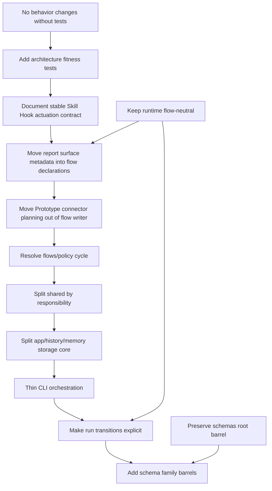

# Circuit Architecture Improvement Roadmap

Status: source-backed roadmap, current as of 2026-06-05.

This document turns the recent system analysis into an improvement roadmap. It is not a rewrite plan. It is a sequence of small changes that make the current design easier to understand, easier to extend, and harder to accidentally complect.

Skill Hooks note: the Skill Hooks runtime seam is stable in this checkout. The current shipped surface has `auto` and `mute` modes, defaults omitted mode to `auto`, and uses `edit-files` hook names. Refresh the Skill Hooks sections only when adding deferred hook arms or lifecycle producers.

The north star is simple:

- contracts flow inward toward `src/schemas`;
- flow-specific product behavior stays in flow packages;
- the runtime executes compiled flow graphs and records trace;
- the CLI parses and prints, while application services compose work around the runtime;
- generic helpers stay generic, or they move.

## Current Baseline

The architecture is already better than a typical agent runner. Flow packages are declarative enough that the runtime does not import individual flow internals, schemas are a true leaf layer, generated host surfaces are checked, and there are real architecture boundary tests.

The remaining problems are mostly boundary problems:

- `src/shared` contains both leaf helpers and higher-level orchestration.
- Some flow-owned report metadata is still centralized in Skill Hook code.
- The runtime loop has several transition rules braided through one function.
- The CLI has become the front door plus the application service.
- The schema root barrel is intentionally complete, but too broad for internal readers.
- `src/flows` and `src/policy` depend on each other.
- Skill Hooks are now a stable runtime seam whose contract needs to stay documented and guarded.
- Some architectural rules exist only as intent, not executable ratchets.
- Prototype flow code reaches into connector resolution.
- App history and memory services import each other.

### Import Graph Snapshot

A lightweight top-level TypeScript import scan of the current checkout found this shape:

```text
MODULES
flows      files=121 exports=570 fanIn=5  fanOut=4  out=connectors,policy,schemas,shared
schemas    files=51  exports=862 fanIn=10 fanOut=0  out=
runtime    files=49  exports=207 fanIn=2  fanOut=6  out=connectors,flows,policy,schemas,shared,skill-hooks
shared     files=42  exports=167 fanIn=7  fanOut=3  out=flows,policy,schemas
app        files=24  exports=117 fanIn=2  fanOut=5  out=flows,memory,runtime,schemas,shared
cli        files=12  exports=47  fanIn=0  fanOut=7  out=app,flows,memory,policy,runtime,schemas,shared
connectors files=8  exports=52  fanIn=2  fanOut=2  out=schemas,shared
policy     files=6   exports=35  fanIn=4  fanOut=2  out=flows,schemas
skill-hooks files=5  exports=17  fanIn=1  fanOut=2  out=schemas,shared
memory     files=4   exports=32  fanIn=2  fanOut=3  out=app,schemas,shared
release    files=2   exports=51  fanIn=0  fanOut=0  out=
index.ts   files=1   exports=1   fanIn=0  fanOut=1  out=schemas

CYCLES
app -> memory -> app
connectors -> shared -> flows -> connectors
connectors -> shared -> policy -> flows -> connectors
flows -> policy -> flows
flows -> shared -> flows
flows -> shared -> policy -> flows
```

Treat this as a smoke alarm, not a complete dependency proof. The existing tests should become the authoritative guardrail.

## Roadmap Summary



The order matters. Guardrails first, the stable Skill Hooks contract next, then cycle-breaking and tree-shaping. The higher-churn changes come after the code has tests that will catch accidental behavior changes.

## 1. Add Architecture Fitness Tests

Severity: high. This is the enabling move.

### Evidence

- `tests/contracts/architecture-boundaries.test.ts:22-81` already guards several boundaries: connector subprocess sharing, runtime trace domain types, verification command execution, `flows` not importing runtime, and `shared/html` not importing flows.
- `tests/contracts/engine-flow-boundary.test.ts:94-224` already guards the engine-to-flow boundary, cross-flow imports, catalog-only flow package imports, and test imports that bypass flow package surfaces.
- The current import graph still has top-level cycles. The existing tests catch some local regressions, but not the full module graph.

### Problem

The codebase has architecture intent, but some intent is only documented. A future change can recreate a cycle or add a new broad dependency without any test failing.

The current positive pattern is good: contract tests walk files with simple import regexes and fail with direct offender lists. Use that style first. Do not add new tooling until simple tests stop being enough.

### Rectification

1. Add a top-level dependency ratchet test in `tests/contracts/architecture-boundaries.test.ts` or a sibling `architecture-fitness.test.ts`.
2. Teach it to group `src/<top-level>` imports and report cycles.
3. Start with an allow-list for the current cycles above. Fail when a new cycle appears.
4. Add separate ratchets for intended final states:
   - no new `src/shared -> src/flows` edges;
   - no new `src/policy -> src/flows` edges except the current canonical-stage policy bridge until it is removed;
   - no new `src/memory -> src/app` edges except the current `project-distill.ts -> app/history/indexer.ts` bridge until the history-store core exists;
   - no new flow package imports from `src/connectors` except the current Prototype variant-options bridge until that is removed.
5. Burn down allow-list entries in the same slice that removes the corresponding dependency.

### Verification

- Run the new architecture test directly.
- Run `npm run check` and `npm run test -- tests/contracts/architecture-boundaries.test.ts tests/contracts/engine-flow-boundary.test.ts`.
- Run `npm run verify` before claiming any source-moving slice is complete.

### Watch-outs

Do not make the first fitness test demand the final architecture immediately. A ratchet is better than a purity test that blocks every branch while roadmap work is landing.

## 2. Document And Guard Skill Hooks As A Stable Seam

Severity: high. This is live runtime behavior, not a future sketch.

### Evidence

- `src/schemas/skill-hook.ts:85-89` defines the shipped policy modes: `auto` injects, `mute` records only, and there is no `ask` mode.
- `src/schemas/skill-hook.ts:94-98` defines the parameterized `before:edit-files` and `after:edit-files` hook-name form.
- `src/runtime/run/graph-runner.ts:610-618` creates one run-scoped Skill Hook injection channel and one run-scoped skill registry.
- `src/runtime/run/graph-runner.ts:1015-1090` appends `step.completed`, then dispatches Skill Hooks, records `run.skill-hook`, starts actuation for `auto` events, and records dispatch failures as non-fatal trace evidence.
- `src/skill-hooks/injection.ts:1-37` documents the current actuation contract: persistent run-scoped accumulator, implementer-only injection, deduped, pure, non-draining.
- `src/runtime/run/relay-guidance.ts:377-403` gates injected Skill Hook skills to implementer relays and passes them into skill loading.
- `src/shared/skill-loading.ts:51-101` merges selected skills, slot bindings, and injected skills, with injected skills last and deduped.
- `tests/contracts/skill-hook-policy-schema.test.ts:162-170` proves omitted mode resolves as `auto`.
- `tests/contracts/skill-hook-policy-schema.test.ts:293-319` proves the vocabulary carries `before:edit-files` and `after:edit-files` anchors and extension-suffix forms.
- `tests/runner/skill-hook-actuation.test.ts:158-210` proves Build `before:edit-files` auto injection.
- `tests/runner/skill-hook-actuation.test.ts:381-411` proves `mute` records an event but injects nothing.
- `tests/runner/skill-hook-actuation.test.ts:417-460` proves `after:verification-failed` injects into a retry, not into the already-completed relay.
- `tests/runner/skill-hook-actuation.test.ts:522-560` proves injected edit skills do not leak into researcher or reviewer relays.
- `tests/unit/skill-hook-injection.test.ts:16-50` proves channel ordering, dedupe, and non-draining reads.

### Problem

Skill Hooks have crossed from policy/reporting into stable actuation. The current behavior is tested, but the architecture contract still needs to be named in one place. If the contract remains implicit in comments and scattered tests, future hook families can quietly change run order, role separation, or retry behavior.

The current design is conservative and should stay that way:

- dispatch is post-step;
- dispatch is best-effort;
- `auto` actuates and is the default when mode is omitted;
- `mute` records an observe-only event;
- injection reaches later implementer relays only;
- injection is run-scoped, persistent, and deduped;
- `ask` is not a shipped policy mode.

### Rectification

1. Write a short contract doc under `docs/contracts/` or `docs/architecture/` that names the shipped actuation contract above.
2. Keep `createSkillHookInjectionChannel` pure. It should not resolve skills, read config, or know relay roles.
3. Keep role gating at the relay guidance seam. That is where the runtime knows which role is about to receive loaded skills.
4. Keep dispatch after `step.completed` unless a future hook family explicitly needs a pre-step producer.
5. If interactive operator approval returns later, model it as a checkpoint or run transition, not as a hidden prompt-side effect.
6. Add one architecture test that prevents `src/skill-hooks` from importing runtime executors or flow packages directly.

### Verification

- Run `npm run test -- tests/runner/skill-hook-actuation.test.ts tests/unit/skill-hook-injection.test.ts tests/runner/skill-hook-dispatch.test.ts tests/contracts/skill-hook-policy-schema.test.ts`.
- Confirm trace order in tests: step event, `run.skill-hook`, then later relay guidance.

### Watch-outs

Do not add more hook kinds before report surface ownership is fixed. Otherwise every new hook will deepen the central table in `src/skill-hooks/surface-sources.ts`.

## 3. Move Flow Report Surface Metadata Into Flow Declarations

Severity: high.

### Evidence

- `src/skill-hooks/surface-sources.ts:1-13` says `before:edit-files` and `after:edit-files` surfaces are "per-flow-declared self-report fields", but the declaration currently lives in a Skill Hooks table.
- `src/skill-hooks/surface-sources.ts:54-72` maps `fix.change-set@v1` and `build.plan@v1` to extractors.
- `src/flows/report-declarations.ts:13-20` already defines `FlowReportDeclaration` with schema name, channel, schema, relay hint, cross-report validator, and writers.
- `src/flows/report-declarations.ts:28-71` already projects report declarations into relay report registries, report schema registries, and writer registries.
- `src/flows/build/reports.ts:185-208` defines `build.plan@v1` fields including `anticipated_file_extensions`.
- `src/flows/build/reports.ts:210-218` defines `build.implementation@v1` with `changed_files`.
- `src/flows/fix/reports.ts:487-520` defines the runtime-owned Fix change-set with `observed`, `declared`, and related path sets.

### Problem

The Skill Hook dispatcher is trying to stay flow-agnostic, but it still owns knowledge about which report schemas expose file surfaces and where those fields live.

This is feature envy. The field exists because a flow report owns it. The metadata about how to interpret that field should live with the flow report declaration, then be projected into a runtime registry.

### Rectification

1. Add optional surface metadata to `FlowReportDeclaration`.

   Suggested shape:

   ```ts
   type FlowReportSurfaceDeclaration =
     | {
        readonly kind: 'edit-files';
         readonly timing: 'before' | 'after';
         readonly extractor: 'string-array-field';
         readonly path: readonly string[];
       }
     | {
        readonly kind: 'edit-files';
         readonly timing: 'before' | 'after';
         readonly extractor: 'build-plan-and-slices-anticipated-file-extensions';
       };
   ```

2. Keep the persisted declaration data simple. Avoid arbitrary extraction functions in flow data because generated surfaces and compiled registries need stable, inspectable shapes.
3. Extend `projectFlowReportDeclarations` to produce a `reportSurfaces` registry keyed by schema name.
4. Teach Skill Hooks to consume the projected registry instead of `EDIT_FILE_SURFACE_SOURCES`.
5. Move the two current sources first:
   - `fix.change-set@v1` after edit-files surface from `observed`;
   - `build.plan@v1` before edit-files surface from plan-level and slice-level `anticipated_file_extensions`.
6. Keep `src/skill-hooks/surface-sources.ts` as a compatibility adapter for one slice if needed, then delete it once the registry is the only reader.

### Verification

- Add a contract test that every Skill Hook file-surface source points at a declared flow report surface.
- Run the Skill Hook actuation and dispatch tests.
- Run catalog completeness tests if the projection becomes catalog-derived.
- Run `npm run check-flow-drift` if generated flow output changes.

### Watch-outs

Do not make the runtime import flow packages to find this metadata. Flow declarations should compile into the same catalog/registry path the runtime already uses.

## 4. Move Prototype Connector Planning Out Of The Flow Writer

Severity: high.

### Evidence

- `src/flows/prototype/writers/variant-options.ts:1-5` imports connector resolver functions from `src/connectors/resolver.ts`.
- `src/flows/prototype/writers/variant-options.ts:45-67` validates Prototype variant connector/model compatibility inside a flow compose writer.
- `src/flows/prototype/writers/variant-options.ts:69-90` resolves variant relay choices from config and connector policy.
- `src/flows/prototype/writers/variant-options.ts:121-145` writes resolved connector name/source into `prototype.variant-options@v1`.
- `src/flows/types.ts:122-135` defines flow-owned axis config prerequisites that the CLI validates before workers run.
- `src/flows/types.ts:181-185` exposes those prerequisites as `CompiledFlowPackage.requiredConfig`.
- `src/flows/prototype/data.ts:737-749` declares `circuits.prototype.variant_models` as required when Prototype runs with the tournament axis.
- `src/cli/circuit.ts:571-590` and `src/cli/circuit.ts:933-938` reject missing required config before creating a run folder.
- `tests/runner/cli-router.test.ts:992-1027` proves Prototype `--tournament` rejects up-front when `variant_models` is absent.
- `src/runtime/run/relay-guidance.ts:271-399` already owns per-relay connector, policy, selection, and skill planning for normal relay steps.

### Problem

Prototype now declares its tournament config prerequisite in the flow package, and the CLI rejects a missing `variant_models` setting before any worker runs. Keep that improvement. The remaining smell is narrower: Prototype variant planning is a flow report writer, but it still reaches into connector policy and resolution. That makes a flow package know too much about worker infrastructure.

The flow should declare the axis requirement, variant requests, and report shape. Connector planning should live in a selection/connector planning service below both runtime guidance and this compose writer.

### Rectification

1. Extract a connector planning contract that is not runtime-owned and not flow-owned. Prefer a neutral module such as `src/selection/connector-planning.ts`; do not make the eventual Prototype caller import `src/connectors`.
2. Give that function an explicit input:
   - flow id;
   - relay role;
   - requested connector reference, if any;
   - layered config;
   - resolved model/effort selection.
3. Reuse it from `planRelayGuidanceDecision` and from Prototype variant-options only after the flow-facing contract is neutral. If the first extraction still needs connector resolver adapters, keep those adapters runtime-facing until a neutral contract exists.
4. Keep Prototype-specific report shaping in the flow writer. Move only connector resolution/compatibility checks out.
5. Add a fitness test: flow packages may not import `src/connectors` directly, with the current Prototype file allow-listed until the migration lands. Do not count the migration done while Prototype imports any connector resolver/planner module under `src/connectors`.
6. Preserve `CompiledFlowPackage.requiredConfig` as the place where a flow declares up-front axis prerequisites. Do not fold that contract into connector planning.

### Verification

- Run Prototype writer tests and connector resolver tests.
- Run `npm run test -- tests/runner/cli-router.test.ts` or a focused equivalent that includes the Prototype `--tournament` missing-config case.
- Run `tests/contracts/engine-flow-boundary.test.ts`.
- Add or update a test that proves `prototype.variant-options@v1` output is byte-equivalent for a fixture before and after the move.

### Watch-outs

Do not move the whole Prototype variant report out of the flow. Only the connector decision belongs elsewhere. The flow still owns its report shape, and the flow package still owns its up-front config prerequisite.

## 5. Resolve The `flows` / `policy` Cycle

Severity: high.

### Evidence

- `src/policy/flow-kind-policy-core.ts:1-10` calls itself the single source of truth for flow-kind canonical stage-set policy, but imports `FLOW_CANONICAL_STAGE_POLICY_BY_ID` from `src/flows/canonical-stage-policy.ts`.
- `src/flows/canonical-stage-policy.ts:1-27` derives policy maps from `flowDefinitions`.
- `src/flows/explore/data.ts:1`, `src/flows/explore/reports.ts:2`, `src/flows/prototype/data.ts:1`, and `src/flows/prototype/reports.ts:2` import rubric tie-break order from `src/policy/rubric.ts`.
- The import graph shows `flows -> policy` and `policy -> flows`.

### Problem

Policy authority points both directions. Some flow-domain policy is derived from the flow catalog, while some flow package report/schema code imports policy values. The code works, but the ownership story is not clean.

The clean rule should be:

- flow-specific policy data belongs with the flow or catalog declaration;
- generic policy evaluators can live in `src/policy`;
- generic policy evaluators should accept data as input, not import the flow catalog.

### Rectification

1. Split data from evaluation.
2. Change `src/policy/flow-kind-policy-core.ts` so it exports pure checkers that accept canonical policy maps as input.
3. Keep catalog-derived canonical stage data in `src/flows/canonical-stage-policy.ts` or move it onto `FlowDefinition`; either is fine if `src/policy` no longer imports it.
4. Put the adapter that validates a compiled flow against catalog-derived stage policy in the flow/catalog side, not in core policy.
5. Decide whether `THREE_AXIS_RUBRIC_TIE_BREAK_ORDER` is generic policy or flow-owned scoring data:
   - if generic, keep it in `src/policy/rubric.ts` and allow flows to import that leaf;
   - if flow-specific, move it into shared flow infrastructure under `src/flows` and let tests import it from there.
6. Add a fitness test that `src/policy` does not import `src/flows`.

### Verification

- Run `npm run test -- tests/contracts/flow-kind-policy.test.ts tests/contracts/review-flow-contract.test.ts tests/contracts/flow-schematic.test.ts`.
- Run catalog completeness tests.
- Run the new dependency ratchet.

### Watch-outs

Do not create a third "policy adapter" layer that imports both sides and becomes the new junk drawer. The important move is data ownership plus pure checking.

## 6. Split `src/shared` By Responsibility

Severity: high.

### Evidence

- `src/shared/README.md:3-20` defines `shared` as helpers used across layers and lists selection/config/skill loading, relay helpers, operator summaries, HTML, proof, verification, fanout, scoring, JSON extraction, schema conversion, run-folder helpers, and runtime-source helpers.
- `src/shared/operator-summary-writer.ts:1-39` imports the flow catalog, schemas, HTML projectors, progress output, result paths, and write-capable-worker disclosure. This is presentation/application orchestration, not a leaf helper.
- `src/shared/operator-summary-writer.ts:189-195` owns digest headline/status shaping, another sign that this file is an app/reporting service rather than a generic helper.
- `src/shared/relay-selection.ts:1-19` imports flow catalog and runtime-index types to derive relay selection.
- `src/shared/skill-loading.ts:1-24` mixes config, skill registry, selection policy, trace evidence, and Skill Hook injection inputs.
- `src/shared/html/index.ts:1-21` is the good pattern: it holds a registry and generic contract, and `src/flows/catalog.ts:57-63` registers flow-specific projectors without `shared/html` importing flows.

### Problem

`shared` is named by usage, not by responsibility. That makes it hard to state a dependency rule. Anything that two modules need can land there, including flow-aware presentation code.

This is the core source of several cycles.

### Rectification

Split by role, not by file size.

1. Keep a very small leaf area for pure helpers:
   - JSON extraction;
   - path safety;
   - hashing or run-artifact IO;
   - schema conversion helpers that do not import flows, runtime, policy, or app.
2. Move application/presentation services out of `shared`:
   - `operator-summary-writer.ts` should live under `src/app` or a `src/app/reports` area;
   - progress/status projection should live with app/reporting unless it is a pure formatter.
3. Move selection and skill loading into a named area:
   - either `src/selection` or `src/skills`;
   - keep Skill Hook injection as input to skill loading, not something the leaf helper owns.
4. Move policy-domain helpers into `src/policy` if they are truly generic policy, or into `src/flows` if they are flow-domain facts.
5. Keep `src/shared/html` as the model for registry-based inversion until it is renamed or moved.
6. Update imports in small batches. Each batch should move one responsibility cluster and update its tests.

### Verification

- Add the dependency ratchet first.
- For each move, run TypeScript, Biome, and the nearest tests.
- Run `npm run verify` before claiming the whole split complete.

### Watch-outs

This is high-churn. Do not start by moving every file. Start with the files that currently create cycles:

- flow-aware operator summary;
- relay selection;
- skill loading if it continues to grow around Skill Hooks;
- policy helpers that import flow data.

## 7. Split App, History, And Memory Storage Core

Severity: medium.

### Evidence

- `src/app/history/run-start-recall.ts:1-13` imports project fact candidates from `src/memory/project-injection.ts`, then queries history and applies earned precision.
- `src/app/history/run-start-recall.ts:99-121` merges prior-run recall with project facts and feeds them through the same precision gate.
- `src/memory/project-distill.ts:1-13` imports `listCandidateRunFolders` from `src/app/history/indexer.ts`, schema contracts, and hashing.
- `src/app/history/indexer.ts:27-32` owns history storage constants for run index files.
- `src/memory/project-store.ts:5-21` owns project memory storage constants and explicitly avoids importing history/run-envelope layout constants.

### Problem

History and memory are conceptually related, but `app` and `memory` currently import each other. That makes storage mechanics and application use cases hard to separate.

The clean shape is:

- a lower history-store/run-corpus core lists run folders and reads durable run artifacts;
- app history query/recall uses that core;
- memory distillation uses that core;
- run-start recall composes history recall and memory facts at the app layer.

### Rectification

1. Extract `listCandidateRunFolders`, history path resolution, and low-level run-corpus file reads into a core that does not import `src/app` or `src/memory`.
2. Point `src/app/history/indexer.ts` at that core.
3. Point `src/memory/project-distill.ts` at that core instead of `src/app/history/indexer.ts`.
4. Keep `run-start-recall.ts` in app. It is allowed to compose history and memory for a run start.
5. Add a fitness test that `src/memory` does not import `src/app`.

### Verification

- Run memory/history tests.
- Run `circuit history` command tests if affected.
- Run `npm run test:fast` if the extraction touches query/rebuild behavior.

### Watch-outs

Do not split history and memory so far apart that shared concepts get duplicated. The target is a lower shared storage core, not two parallel storage implementations.

## 8. Thin CLI Orchestration

Severity: medium.

### Evidence

- `src/cli/circuit.ts:1-67` imports runtime, app history, process evidence, autonomous continuation, flows, policy, config loading, operator summary, progress, run output, and runtime routing policy.
- `src/cli/circuit.ts:701-745` dispatches top-level commands and delegates existing extracted commands such as handoff, history, memory, create, and runs.
- `src/cli/circuit.ts:748-852` contains checkpoint resume orchestration, runtime resume, operator summary writing, process evidence projection, and stdout envelope creation.
- `src/cli/circuit.ts:854-1354` contains fresh run routing, fixture loading, config discovery, up-front flow config validation, history recall, runtime execution, checkpoint waiting output, operator summary writing, run envelope writing, autonomous continuation, and final stdout output.
- `src/cli/post-run-artifacts.ts` already exists and is used as an extraction point.

### Problem

The CLI is both the front door and the application service. That increases churn in the command file whenever runtime, history, memory, progress, or post-run artifacts change.

The good local pattern is already present: `handoff`, `history`, `memory`, `create`, and `runs` have command modules. `run` and `resume` should follow that pattern.

### Rectification

1. Extract `runResumeCommand` into `src/cli/resume.ts` or an app service plus a thin CLI wrapper.
2. Extract `runExecutionCommand` into `src/cli/run.ts` or `src/app/run-command.ts`.
3. Keep argument parsing, commander errors, and stdout/stderr formatting close to CLI.
4. Move use-case orchestration under app:
   - route goal to flow;
   - load fixture;
   - discover config;
   - prepare history recall;
   - call runtime;
   - emit post-run artifacts.
5. Keep runtime ignorant of CLI output concerns.
6. After extraction, `src/cli/circuit.ts` should mostly parse top-level command and delegate.

### Verification

- Run `npm run test -- tests/runner/cli-router.test.ts tests/runner/cli-runtime.test.ts`.
- Run post-run artifact tests.
- Check stdout JSON compatibility with fixture tests before and after extraction.

### Watch-outs

Do not move Commander types or process IO into runtime. CLI can stay responsible for process details.

## 9. Make Run Transitions Explicit

Severity: medium.

### Evidence

- `src/runtime/run/graph-runner.ts:592-645` builds a large `RunContext` with files, trace, config, policies, Skill Hook injections, memory inputs, history recall, project root, progress, and execution capabilities.
- `src/runtime/run/graph-runner.ts:741-850` enters each step, computes attempt/cycle state, appends `step.entered`, executes the step, handles checkpoint waiting, and handles executor errors.
- `src/runtime/run/graph-runner.ts:852-864` mutates routes for slice-loop advancement.
- `src/runtime/run/graph-runner.ts:866-1013` validates route targets, recovery bindings, cycle guards, max attempts, recovery corridor entry/exit, and recovery guidance.
- `src/runtime/run/graph-runner.ts:1015-1097` appends `step.completed`, dispatches Skill Hooks, closes terminal targets, or advances to the next step.
- `src/runtime/executors/sub-run.ts:261-290` routes a non-complete child result through a declared `stop` route instead of aborting the parent.
- `tests/runtime/sub-run.test.ts:290-330` proves that child non-success closes the parent as stopped when the route is declared.
- `src/runtime/run/recovery-corridor.ts` and `src/runtime/run/slice-corridor.ts` are positive extractions. The loop has started to shed concepts, but the transition order still lives in one function.

### Problem

Run behavior is transition-heavy. The order of events matters:

- `step.entered`;
- executor trace entries;
- possible checkpoint wait;
- route selection and validation;
- recovery/cycle handling;
- `step.completed`;
- `run.skill-hook`;
- terminal close or next step.

Right now, that timeline is implicit in one long loop. That makes new behavior risky because a small insertion can change trace order, retry semantics, or terminal closure.

### Rectification

1. Add characterization tests for the current transition order before extracting.
2. Extract a pure transition classifier from the loop:

   ```ts
   type StepTransition =
     | { kind: 'advance'; nextStepId: string; route: string }
     | { kind: 'close'; target: TerminalTarget; route: string }
     | { kind: 'checkpoint_waiting'; checkpoint: CheckpointWaiting }
     | { kind: 'abort'; reason: string };
   ```

3. Keep IO outside the pure classifier. Trace appends and file writes stay in the runner.
4. Keep recovery and slice corridors as collaborators, not as hidden global state.
5. Move Skill Hook dispatch into a named transition phase such as `afterStepCompleted`.
6. Once the transition model exists, document it in `docs/architecture/run-process.md`.

### Verification

- Add tests for trace order and route outcomes.
- Run runtime tests, especially checkpoint, recovery, pass-cycle, Build slice loop, and Skill Hook actuation tests.
- Run `npm run verify` for any runtime extraction.

### Watch-outs

Do not let flow packages own runtime transitions. A flow declares graph routes. The runtime owns how a route becomes trace, retry, checkpoint, hook dispatch, or closure.

## 10. Add Schema Family Barrels Without Removing The Root Barrel

Severity: medium.

### Evidence

- `src/schemas/index.ts:1-50` re-exports every schema module.
- `tests/contracts/schemas-barrel.test.ts:1-58` explicitly requires every `src/schemas/<name>.ts` file to be re-exported by `src/schemas/index.ts`.
- The import graph shows `src/schemas` has 51 files, 862 exports, fan-in 10, and fan-out 0. The direction is healthy; the surface is simply broad.
- Historical context: `docs/ideas/architecture-hardening-plan-v2.md` later dropped the idea of replacing the schema barrel because it contradicted the test-enforced completeness invariant. The active source of truth is the test above.

### Problem

The root schema barrel is useful as a completeness/public-contract surface, but it is too wide for internal readers. Internal code that imports from the root barrel gets no clue whether it is working with run contracts, host contracts, policy contracts, flow contracts, or evidence contracts.

### Rectification

1. Keep `src/schemas/index.ts` and its completeness test.
2. Add family entrypoints:
   - `src/schemas/run-index.ts`;
   - `src/schemas/flow-index.ts`;
   - `src/schemas/host-index.ts`;
   - `src/schemas/policy-index.ts`;
   - `src/schemas/evidence-index.ts`.
3. Start migrating internal imports to family barrels when touching files for another reason.
4. Add tests that family barrels:
   - export only intended contract families;
   - do not import source layers;
   - do not overlap accidentally except for deliberate primitives like ids and refs.
5. Defer package-public export hardening until there is a real package export map or external consumer pressure.

### Verification

- Run schema barrel tests.
- Add family barrel tests.
- Run `npm run check`.

### Watch-outs

Do not remove the root barrel as part of this roadmap. That would fight current drift protection and create churn without clear benefit.

## Harmonized Sequence

The roadmap should land in this order:

1. **Architecture fitness tests.** Add ratchets with current-cycle allow-lists.
2. **Skill Hooks contract doc and tests.** Document and guard the stable actuation behavior before broadening hooks.
3. **Flow report surface metadata.** Move file-surface sources into flow report declarations.
4. **Prototype connector planning.** Move connector resolution/compatibility below both runtime guidance and Prototype writer.
5. **Flow/policy cycle.** Split policy data from pure policy evaluation.
6. **Shared split, first cycle-causing clusters only.** Move operator summary, selection, skill loading, and policy helpers by responsibility.
7. **History/memory storage core.** Break `app -> memory -> app` with a lower run-corpus core.
8. **CLI run/resume extraction.** Move use-case orchestration into command modules or app services.
9. **Run transition model.** Extract after characterization tests, using the newly stable Skill Hook and recovery seams.
10. **Schema family barrels.** Add as a reader-aid and migration path, keeping the root barrel intact.

## Tensions And Resolutions

### Skill Hooks Need Flow Metadata, But Runtime Must Stay Flow-Neutral

Resolution: flow declarations own metadata; catalog projection produces a registry; Skill Hooks consume the registry. No runtime import of per-flow packages.

### Schema Surface Is Too Wide, But The Root Barrel Is Intentional

Resolution: add family barrels for internal clarity. Keep the root barrel and its completeness test.

### Fitness Tests Should Enforce Better Boundaries, But Current Cycles Exist

Resolution: use ratchets. Allow-list current cycles with names and removal tickets. Fail on new cycles. Remove allow-list entries as the roadmap lands.

### `shared` Split Has High Churn

Resolution: do not dissolve `shared` wholesale first. Move cycle-causing and high-level orchestration clusters first. Leave pure helpers alone until a touch point justifies moving them.

### Run Transition Model Could Become An Over-Abstract State Machine

Resolution: start with a small transition classifier over the existing loop. Keep IO and trace appends explicit. Do not introduce a framework.

### History And Memory Need Shared Storage, But Memory Should Not Become App

Resolution: extract a lower run-corpus/history-store core. App can compose memory and history at run start; memory can mine run folders without importing app.

## What Not To Do

- Do not hide boundary problems behind facades that keep the same dependency direction.
- Do not move flow-specific report shaping out of flow packages.
- Do not make the runtime import individual flow modules.
- Do not remove the schema root barrel during the family-barrel work.
- Do not make Skill Hook dispatch able to fail a run unless that becomes an explicit policy and transition.
- Do not introduce dependency-cruiser or another graph tool before the simple contract-test approach is exhausted.

## Definition Of Done For The Roadmap

The roadmap is complete when:

- the top-level import graph has no unplanned cycles;
- `src/shared` can be described in one sentence without exceptions;
- flow report surface metadata lives with flow report declarations;
- Skill Hook actuation behavior is documented and tested as a contract;
- Prototype flow code no longer imports connector resolution;
- `src/policy` does not import `src/flows`;
- `src/memory` does not import `src/app`;
- run/resume orchestration is outside the root CLI file;
- the runtime transition order is tested and named;
- schema family barrels exist, while the root schema barrel remains complete.
