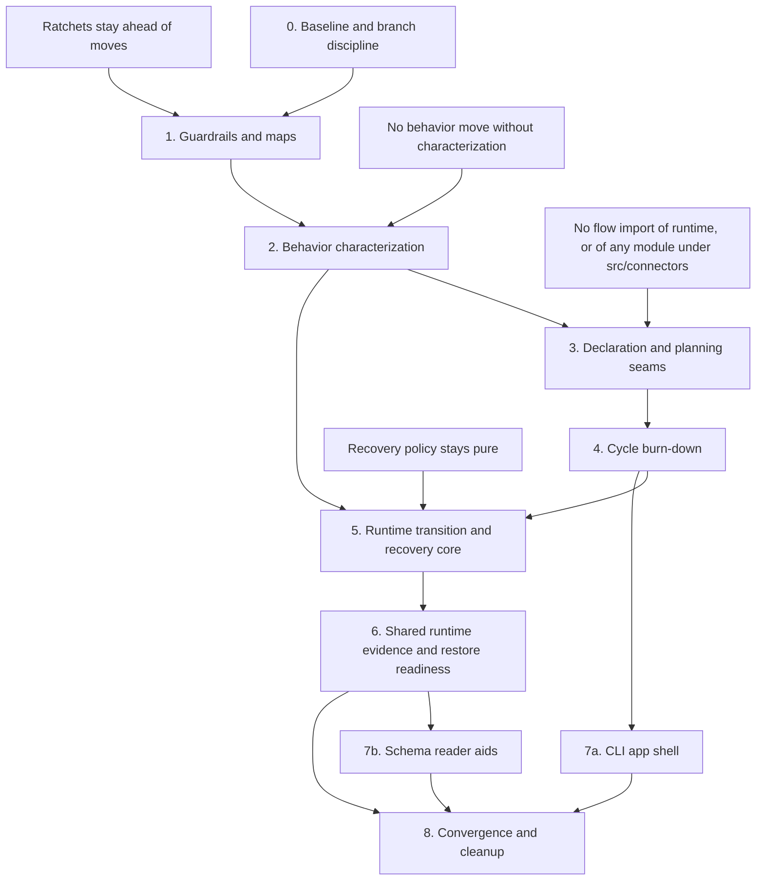

# Architecture Revamp Staged Plan

Status: staged execution plan, current as of 2026-06-05.

Purpose: turn the architecture roadmap, prefactoring plan, and recovery/restore addendum into one execution program. This document does not implement the revamp. It defines the order, branch slices, gates, rollback rules, and evidence map for doing the work without losing the simplicity goal.

Primary inputs (each is a whole document; the ranges below are start-here pointers, not the full source the plan draws on):

- `docs/architecture/architecture-improvement-roadmap.md` (north star and import-graph snapshot at `:9-62`; the ten roadmap items run to `:561`; definition of done at `:613-626`)
- `docs/architecture/roadmap-prefactoring-plan.md` (ranks begin at `:38`; definition of ready at `:519-531`)
- `docs/architecture/recovery-restore-roadmap-addendum.md` (six opportunities begin at `:24`; fold-in list at `:486-501`)

## Target Shape

The target architecture is not a new framework. It is the current architecture with sharper ownership:

- contracts flow inward toward schemas;
- flow-specific behavior stays in flow packages;
- runtime owns graph execution, route interpretation, trace order, recovery mechanics, and terminal closure;
- CLI parses and prints while app services compose use cases;
- shared code is shared by responsibility, not by convenience;
- architecture intent is guarded by tests before files move.

Those constraints come from the roadmap north star and current baseline in `docs/architecture/architecture-improvement-roadmap.md:9-32`.

## Terms

Short definitions for load-bearing words used throughout, so the plan is self-contained for a new engineer.

- Ratchet: an architecture test that freezes a baseline and fails when a new boundary violation appears beyond a named allow-list. Existing ratchets live in `tests/contracts/architecture-boundaries.test.ts` and `tests/contracts/engine-flow-boundary.test.ts`.
- Allow-list: the named set of currently tolerated edges or cycles a ratchet permits. Burning one down means removing an allow-list entry in the same branch that removes the edge it covered.
- Seam: a neutral interface inserted before a move so the later ownership change is small and reviewable.
- `StepKind`: the runtime step-kind union (`src/runtime/domain/step.ts`): `compose`, `verification`, `checkpoint`, `relay`, `sub-run`, `fanout`.
- `RecoveryRouteKind`: the recovery route union the projection and schema validate (`src/schemas/recovery-route-kind.ts`).
- Barrel: a module that re-exports a group of other modules so callers import from one place. The root barrel is `src/schemas/index.ts` (kept complete); family barrels are smaller per-area re-export modules added as reader aids.
- SafeApply: the runtime authority that decides whether a worker's change set may be applied to the parent checkout. It consumes touched-file evidence but is the authority decision, not the evidence (`src/schemas/change-packet.ts`, `src/schemas/trace-entry.ts`).

## Stage Topology



Stage numbers are the default reading order, not a serial lock. After Stage 4, Stage 5 and the CLI branch of Stage 7 can proceed in parallel only if Stage 2 characterization is complete, the branches do not share files, and Stage 5 preserves the runtime call, recovery-result, and checkpoint-waiting-predicate contract that the CLI run/resume and recovery-retry paths consume (the execution and recovery-retry path `src/cli/circuit.ts:854-1354` reads `isGraphCheckpointWaitingResult` from `src/runtime/run/graph-runner.ts:107` and branches on the recovery-result shape; the resume path `src/cli/circuit.ts:748` consumes the runtime result shape via `resumeCompiledFlow` and `RunResult`). File non-overlap is necessary but not sufficient: these two branches are coupled through that internal runtime contract even with zero shared files. If Stage 5 changes the result shape, sequence the Stage 7a recovery-loop extraction after Stage 5 instead of in parallel. The schema-reader branch of Stage 7 waits for Stage 6, because recovery policy, StepKind alignment, and shared runtime evidence should settle before schema import aids spread those concepts. Stage 8 waits for all active branches to converge.

The diagram is a primary reading-order topology, not a full dependency graph. Some prose preconditions are satisfied transitively and not drawn as direct edges: the Stage 5 StepKind alignment ratchet gates Stage 7b (via `S5 --> S6 --> S7B`), and Stage 2 characterization gates Stage 7a (via `S2 --> S3 --> S4 --> S7A`). The Traceability Matrix records these supporting relationships. Conversely, the drawn `S4 --> S5` edge is conservative reading-order rather than a file or seam dependency: Stage 5 edits runtime files Stage 4 does not move and only needs to stay compatible with the Stage 4 `src/policy` ratchet, so its true predecessor is Stage 2 characterization.

## Operating Rules

1. Run each numbered stage as one or more small branches. A stage can have multiple branches; a branch should have one behavioral claim.
2. Start with characterization and ratchets. Do not move ownership until the existing behavior is pinned.
3. Remove allow-list entries in the same branch that removes the corresponding dependency edge.
4. Preserve public contracts unless a stage explicitly says a new public contract is being introduced.
5. Run `npm run verify` before claiming any source-moving stage complete. For docs-only planning updates, run `npm run check` and verify citations by opening each cited `path:line` and confirming it still matches; the repo has no automated citation checker.
6. If a stage touches generated flow output, host runtime bundles, or schemas, run the corresponding drift checks before review.

## Stage 0: Baseline And Branch Discipline

Objective: create a trustworthy starting line before any architecture branch.

Inputs:

- Prefactoring Rank 0: `docs/architecture/roadmap-prefactoring-plan.md:38-67`
- Documentation precedence rule: `docs/README.md:65-66`

Work:

1. Confirm `npm run verify` passes on the branch that will be used as the base.
2. Record `git status --short` before starting each stage branch.
3. Ensure generated outputs are either unchanged or intentionally regenerated.
4. Keep unrelated dirty work out of the branch.

Verification:

```bash
npm run verify
git status --short
```

A clean baseline means `npm run verify` is green and `git status --short` shows no dirty source or generated files. Unrelated dirty docs (the base currently carries several, including this plan) must be committed or stashed before the stage branch starts, so a later failure is unambiguously stage-owned.

Rollback or stop:

- Stop if full verify fails before architecture work begins. Diagnose that first.
- Stop if generated surfaces are already dirty and the branch is not meant to own generated output.
- Stop if unrelated source files are dirty. Commit or stash them first; otherwise a later failure cannot be attributed to the stage.

Completion signal:

- A clean baseline exists by the definition above, and every later stage can treat a new failure as stage-owned until proven otherwise.

## Stage 1: Guardrails And Maps

Objective: make architectural drift visible before source ownership moves.

Inputs:

- Roadmap item 1: `docs/architecture/architecture-improvement-roadmap.md:86-122`
- Prefactoring Ranks 1 and 2: `docs/architecture/roadmap-prefactoring-plan.md:69-139`
- Shared inventory prep: `docs/architecture/roadmap-prefactoring-plan.md:442-480`

Current source evidence:

- `tests/contracts/architecture-boundaries.test.ts:22-81`
- `tests/contracts/engine-flow-boundary.test.ts:94-223`
- `src/shared/README.md:3-20`

Work:

1. Extract shared import-walking helpers for contract tests.
2. Add a top-level import graph ratchet seeded with the current cycles (the CYCLES block at `docs/architecture/architecture-improvement-roadmap.md:53-60`, inside the Import Graph Snapshot at `:34-62`) as a named allow-list. Reconcile the seed against a live import scan at implementation time; the roadmap snapshot is a smoke alarm, not a complete dependency proof (`:62`).
3. Add explicit ratchet rules for the final intended boundaries. Author each rule now, seeded with the current offending edge in its allow-list, so the rule exists before any move ("ratchets stay ahead of moves") and Stage 1's own gate still passes while the edge is present. Remove the allow-list entry (tightening the rule to the final state) in the same branch that removes the edge:
   - no new `src/shared -> src/flows` edges. Seed the allow-list with all four current edges: `src/shared/relay-selection.ts`, `src/shared/operator-summary-writer.ts`, `src/shared/relay-support.ts`, and `src/shared/selection-resolver.ts` (confirm with a live scan per work item 2); tighten in Stage 4;
   - no new `src/policy -> src/flows` edges; allow only the current `src/policy/flow-kind-policy-core.ts -> src/flows/canonical-stage-policy.ts` bridge until Stage 4 removes it;
   - no new `src/memory -> src/app` edges; allow only the current `src/memory/project-distill.ts -> src/app/history/indexer.ts` bridge until Stage 4 lands the run-corpus core. A new `src/memory -> src/app` edge would otherwise stay inside the existing `app -> memory -> app` cycle, add no new top-level cycle, and evade the cycle ratchet in work item 2, so this edge-level rule is what catches it;
   - no new flow package imports from `src/connectors`; allow only the current `src/flows/prototype/writers/variant-options.ts -> src/connectors/resolver.ts` bridge until the Stage 3 Prototype move removes it.
4. Add a ratchet that prevents `src/skill-hooks` from importing runtime executors or flow packages directly (roadmap item 2, `docs/architecture/architecture-improvement-roadmap.md:166`). It pins an already-clean state (`src/skill-hooks` imports only schemas and shared today), so it needs no allow-list entry.
5. Create a shared ownership inventory before moving files.

Verification:

```bash
npm run test -- tests/contracts/architecture-boundaries.test.ts tests/contracts/engine-flow-boundary.test.ts
npm run check
```

Rollback or stop:

- Stop if the graph ratchet reports cycles not represented in the current allow-list. Either the graph script is wrong, or the baseline changed.
- Roll back only the helper extraction if it makes offender messages worse. Clear offender output is part of the contract.

Completion signal:

- Future branches cannot add new top-level cycles silently.
- `src/shared` has a cluster inventory with first-move candidates and destinations.

## Stage 2: Behavior Characterization

Objective: pin the behavior that later stages will move.

Inputs:

- Roadmap item 2: `docs/architecture/architecture-improvement-roadmap.md:124-175`
- Roadmap item 9 problem statement: `docs/architecture/architecture-improvement-roadmap.md:464-520`
- Prefactoring Ranks 3, 8, and 9: `docs/architecture/roadmap-prefactoring-plan.md:141-176`, `docs/architecture/roadmap-prefactoring-plan.md:335-412`
- Recovery addendum slot: `docs/architecture/recovery-restore-roadmap-addendum.md:13-22`

Current source evidence:

- `src/runtime/run/graph-runner.ts:1015-1097`
- `src/runtime/run/relay-guidance.ts:377-403`
- `src/schemas/skill-hook.ts:4-12`
- `src/schemas/skill-hook.ts:45-55`
- `src/schemas/skill-hook.ts:85-98`
- `src/schemas/skill-hook.ts:150-153`
- `src/skill-hooks/injection.ts:1-37`
- `tests/runner/skill-hook-actuation.test.ts:158-210`
- `tests/runner/skill-hook-actuation.test.ts:381-411`
- `tests/contracts/skill-hook-policy-schema.test.ts:162-170`
- `tests/contracts/skill-hook-policy-schema.test.ts:293-320`
- `tests/runtime/sub-run.test.ts:290-330`
- `tests/runtime/sub-run.test.ts:559-596`
- `tests/runner/cli-router.test.ts:1-220`

Work:

1. Add a Skill Hooks contract doc or architecture section naming the shipped behavior: `auto`/`mute`; omitted policy-rule mode resolves to `auto`; shipped vocabulary entries keep their own `default_mode`; valid file hooks are `before:edit-files`, `after:edit-files`, and extension-suffix forms; dispatch happens after `step.completed`; dispatch is best-effort; injection is implementer-only and uses a run-scoped non-draining channel.
2. Add a narrow trace-order characterization test showing `step.completed` before `run.skill-hook`, and later implementer relay skill loading after injection.
3. Add or tighten CLI run/resume stdout characterization fixtures before moving run/resume orchestration.
4. Add run transition characterization tests for normal advance, invalid route, cycle abort, recovery retry, checkpoint waiting, and the existing sub-run stopped-parent behavior.

Verification:

```bash
npm run test -- tests/runner/skill-hook-actuation.test.ts tests/unit/skill-hook-injection.test.ts tests/runner/skill-hook-dispatch.test.ts tests/contracts/skill-hook-policy-schema.test.ts
npm run test -- tests/runner/cli-router.test.ts tests/runner/cli-runtime.test.ts
npm run test -- tests/runtime tests/runner/pass-route-cycle-guard.test.ts tests/runner/build-runtime-wiring.test.ts
npm run check
```

Rollback or stop:

- Stop if a characterization test requires changing production code. That means the current behavior was misunderstood.
- Do not widen Skill Hooks, add new hook families, or create a transition abstraction in this stage.

Completion signal:

- Hook order, role separation, run/resume output, and transition outcomes are pinned by tests, and the Skill Hooks contract doc exists with each behavior claim backed by a cited test or source location.

## Stage 3: Declaration And Planning Seams

Objective: introduce neutral seams that let later ownership moves become small.

Inputs:

- Roadmap items 3, 4, and 5: `docs/architecture/architecture-improvement-roadmap.md:177-325`
- Prefactoring Ranks 4, 5, and 6: `docs/architecture/roadmap-prefactoring-plan.md:178-293`

Current source evidence:

- `src/skill-hooks/surface-sources.ts:1-13`
- `src/skill-hooks/surface-sources.ts:54-72`
- `src/flows/report-declarations.ts:13-20`
- `src/flows/report-declarations.ts:28-71`
- `src/flows/prototype/writers/variant-options.ts:1-5`
- `src/flows/prototype/writers/variant-options.ts:45-90`
- `src/flows/types.ts:122-135`
- `src/flows/prototype/data.ts:737-749`
- `src/runtime/run/relay-guidance.ts:29-326`
- `src/policy/flow-kind-policy-core.ts:7-10`
- `src/flows/canonical-stage-policy.ts:1-28`

Work:

1. Add flow report surface declaration vocabulary and projection while `EDIT_FILE_SURFACE_SOURCES` remains live. The declaration must be a serializable tagged union (per roadmap item 3's `FlowReportSurfaceDeclaration`), not a relocated live `extract` function, so the serializable-and-inspectable rollback condition below is reachable. The nested per-slice case needs a named extractor to author (roadmap item 3 proposes `build-plan-and-slices-anticipated-file-extensions`), mirroring the existing inline union at `src/skill-hooks/surface-sources.ts:36-46`.
2. Move `fix.change-set@v1` and `build.plan@v1` file-surface metadata into flow report declarations, then switch Skill Hooks to consume the projected registry.
3. Extract a neutral flow-safe connector planning contract at `src/selection/connector-planning.ts` (the destination named by both inputs: roadmap-prefactoring-plan Rank 5 and architecture-improvement-roadmap item 4). Any adapter around `src/connectors/resolver.ts` remains runtime-facing. `src/selection` is a new top-level directory: register it and its intended edges with the Stage 1 import graph ratchet's node inventory in this branch, so a later `src/selection -> src/runtime` or `src/selection -> src/flows` back-edge is caught.
4. Keep Prototype's `requiredConfig` contract flow-owned and unchanged.
5. Move Prototype variant planning to the neutral planning seam only after the seam is tested. The flow writer keeps report shaping.
6. Add a pure flow-kind policy checker that accepts policy tables as input while preserving the old wrapper. This is a capability milestone only: the `src/policy -> src/flows` import edge survives until Stage 4 removes it. Resolve roadmap item 5's open question (`docs/architecture/architecture-improvement-roadmap.md:312-315`) by treating `THREE_AXIS_RUBRIC_TIE_BREAK_ORDER` as a generic policy leaf that flows may import from `src/policy/rubric.ts`, because the reverse `flows -> policy` edge already exists and re-homing the constant would add churn for no boundary gain; this edge is intentionally retained.

Verification:

```bash
npm run test -- tests/contracts/catalog-completeness.test.ts tests/runner/skill-hook-dispatch.test.ts
npm run test -- tests/runtime/connectors.test.ts tests/runner/runner-relay-connector-identity.test.ts tests/contracts/codex-connector-schema.test.ts tests/runner/cli-runtime.test.ts tests/runner/cli-router.test.ts
npm run test -- tests/contracts/flow-kind-policy.test.ts tests/contracts/flow-schematic.test.ts
npm run check
```

Generated-output gates:

- Run `npm run check-flow-drift` if flow declarations or generated flow output changes.

Rollback or stop:

- Stop if Prototype would still need to import a module under `src/connectors` after the move.
- Stop if report surface declarations require arbitrary live functions in flow data. Declarations must stay serializable and inspectable.
- Stop if the flow-kind checker extraction creates a new adapter that imports both sides and becomes another cycle.

Completion signal:

- Skill Hook file surfaces are flow-declared.
- Prototype no longer imports any module under `src/connectors`.
- A pure flow-kind policy checker exists that does not need the flow table baked in. The `src/policy -> src/flows` edge itself is not removed until Stage 4; this is a capability milestone, not the edge removal.

## Stage 4: Cycle Burn-Down

Objective: remove the known top-level cycles using the seams already prepared.

Inputs:

- Roadmap items 5, 6, and 7: `docs/architecture/architecture-improvement-roadmap.md:285-419`
- Prefactoring Rank 7 and Rank 11: `docs/architecture/roadmap-prefactoring-plan.md:295-333`, `docs/architecture/roadmap-prefactoring-plan.md:442-480`

Current source evidence:

- `src/shared/operator-summary-writer.ts:1-39`
- `src/shared/operator-summary-writer.ts:189-195`
- `src/shared/relay-selection.ts:1-19`
- `src/shared/skill-loading.ts:1-24`
- `src/shared/html/index.ts:1-21`
- `src/app/history/run-start-recall.ts:1-13`
- `src/memory/project-distill.ts:1-13`
- `src/app/history/indexer.ts:27-32`
- `src/memory/project-store.ts:5-21`

Work:

1. Remove `src/policy -> src/flows`. The edge lives in the core (`src/policy/flow-kind-policy-core.ts:10` imports the canonical-stage policy table from `src/flows`), not in the wrapper. Per roadmap item 5, invert the core so it accepts the canonical policy maps as input (no `src/flows` import in core) and move the catalog-binding step onto the flow/catalog side. Keep pure policy checks in policy.
2. Move the cycle-causing shared clusters. Treat the architecture ratchet's offender list as the authority for the live `shared -> flows` edge set (it matches `/flows/` at any depth across static, re-export, dynamic, and side-effect imports). Today that set is four files; a quick `grep -rl "from '\.\./flows/" src/shared --include='*.ts'` finds the current flat-file edges but is narrower than the ratchet, so confirm against the ratchet offender output before tightening. The `shared -> flows` rule cannot tighten to its final state until every edge is relocated or inverted; an edge that is only allow-listed stays in place and keeps the folder cycle as a documented exception. Give each edge an explicit disposition:
   - `relay-selection.ts` (value import of `src/flows/catalog.ts`, plus a type-only `runtime-index` import): move to selection ownership. Because it has a value flows import, a bare move would only rename `shared -> flows` to `selection -> flows`, so decide explicitly: either invert the catalog lookup through a registry (so `src/selection` imports schemas only) or accept a deliberate `src/selection -> src/flows` edge and register it in the Stage 1 ratchet node inventory with a stated rationale. `selection-resolver.ts` (a type-only flows import; its only production consumer is relay-selection, though two tests import it too) moves with it.
   - `operator-summary-writer.ts` (value import of `findFlowRuntimeSurfaceById`): move to app reporting. This relocates rather than removes the flows dependency, so decide explicitly: either invert the lookup through a registry (mirroring the `src/shared/html` inversion model in work item 3) or accept `src/app -> src/flows` as an intentional edge (one already exists via `src/app/process-evidence/projection.ts`) and add it to the import-graph allow-list. Do not leave it as a facade that preserves the edge direction.
   - `relay-support.ts` (value import of `findRelayShapeHint` from `src/flows/registries/shape-hints/registry.ts`): consumed only by `src/runtime`, so it sits on a `runtime -> shared -> flows` path, not the `flows -> shared -> flows` cycle. It still carries a `shared -> flows` text edge the ratchet sees, so give it an explicit disposition: move it to a runtime-or-selection home that may legitimately depend on flows, invert the shape-hint lookup through a registry, or allow-list this single edge with that rationale. Relocating or inverting it removes the edge and helps close `flows -> shared -> flows`; allow-listing instead keeps that folder cycle as a documented exception.
   - policy-domain helpers to their actual owner.

   `src/shared/skill-loading.ts` is not cycle-causing (it imports only schemas and a sibling registry). Move it only if it keeps growing around Skill Hooks, as a responsibility-clarity move with that rationale stated, not as part of this cycle burn-down.
3. Preserve `src/shared/html` as the inversion model until a later rename is worth it.
4. Extract a lower run-corpus/history-store core that both app history and memory can use.
5. Point memory distillation at that core, not at app history.
6. Remove each ratchet allow-list entry in the branch that breaks it.

Verification:

```bash
npm run test -- tests/contracts/flow-kind-policy.test.ts tests/contracts/review-flow-contract.test.ts tests/contracts/flow-schematic.test.ts
npm run test -- tests/runner/history*.test.ts tests/unit/history*.test.ts tests/unit/project-distill.test.ts
npm run test -- tests/runner/operator-summary-writer.test.ts tests/runner/skill-hook-actuation.test.ts tests/runner/skill-hook-dispatch.test.ts
npm run check
```

Rollback or stop:

- Stop if a move preserves the dependency direction through a facade. The point is to remove the edge, not rename it.
- Stop if the shared split starts moving pure leaf helpers only because they live in `shared`.
- Stop if memory and history begin duplicating run-folder logic instead of sharing a lower core.

Completion signal:

- `src/policy` no longer imports `src/flows`.
- `src/memory` no longer imports `src/app`.
- The graph ratchet has fewer allow-listed cycles than at Stage 1.
- The remaining `shared` files have clear responsibility labels.

The six cycles in the roadmap snapshot (`docs/architecture/architecture-improvement-roadmap.md:53-60`) retire across Stages 3 and 4, not Stage 4 alone. The two connector-rooted cycles (`connectors -> shared -> flows -> connectors` and `connectors -> shared -> policy -> flows -> connectors`) close with the Stage 3 Prototype move that removes the only `src/flows -> src/connectors` edge. `flows -> shared -> flows` closes only once Stage 4 relocates or inverts every `shared -> flows` edge in work item 2 (all four, not two), physically removing the folder edge. Allow-listing an edge instead leaves it in place, so that disposition retains the folder cycle as a documented exception rather than closing it. `flows -> policy -> flows` and `flows -> shared -> policy -> flows` both close when Stage 4 work item 1 removes the single `src/policy -> src/flows` edge; the `shared -> policy` edge (via `rubric.js`) is intentionally retained and is not the edge removed to close either cycle. `app -> memory -> app` closes when Stage 4 work items 4-5 remove the `memory -> app` edge.

## Stage 5: Runtime Transition And Recovery Core

Objective: make route interpretation explicit while keeping recovery pure and side effects in executors.

Inputs:

- Roadmap item 9: `docs/architecture/architecture-improvement-roadmap.md:464-520`
- Prefactoring Rank 9 (run transition characterization prep): `docs/architecture/roadmap-prefactoring-plan.md:373-413`
- Recovery Opportunities 1, 2, and 5: `docs/architecture/recovery-restore-roadmap-addendum.md:24-165`, `docs/architecture/recovery-restore-roadmap-addendum.md:288-362`
- Recovery fold-in recommendation: `docs/architecture/recovery-restore-roadmap-addendum.md:486-501`

Current source evidence:

- `src/runtime/run/graph-runner.ts:741-1097`
- `src/runtime/run/recovery-corridor.ts:1-16`
- `src/runtime/run/recovery-corridor.ts:61-180`
- `src/runtime/run/slice-corridor.ts:1-13`
- `src/runtime/run/slice-corridor.ts:38-113`
- `src/schemas/recovery-route-kind.ts:5-15`
- `src/schemas/recovery-route-kind.ts:92-188`
- `src/shared/work-contract-projection.ts:53-155`
- `src/shared/work-contract-projection.ts:162-263`
- `src/shared/work-contract-projection.ts:496-515`
- `tests/contracts/work-contract-projection.test.ts:328-335`
- `src/runtime/domain/step.ts:5-5`
- `src/runtime/executors/index.ts:13-51`
- `src/runtime/manifest/from-compiled-flow.ts:104-150`

Work:

1. Centralize recovery route projection policy in one pure table keyed by `RecoveryRouteKind`. The table imports schemas only (no `src/flows`), so it stays compatible with the Stage 4 "`src/policy` does not import `src/flows`" ratchet wherever it lives. Name its home explicitly when the branch lands; the addendum suggests `src/policy/recovery-route-policy.ts`, but any schema-only module works.
2. Extract the cause/ref contract rules currently inlined in `src/schemas/recovery-route-kind.ts` superRefine into an exported schema-local rule set, then have both the schema and the projection consume it instead of each encoding the same kind-to-cause/ref knowledge in a different form (the schema validates it, the projection derives it). The reusable rule set does not exist yet, so this is extract-then-reuse, not reuse.
3. Preserve target-sensitive retry semantics: same-step retry and broad retry remain distinct.
4. Add a recovery-kind reachability ratchet with an explicit intentionally-unreachable allow-list.
5. Add a StepKind alignment ratchet comparing the runtime kind union (`src/runtime/domain/step.ts`), the `ExecutableStep` interface union (`src/runtime/manifest/executable-flow.ts`, a separately hand-maintained list), schema variants, executable conversion, executor registry, and work-contract projection keys. This ratchet is intentionally pulled earlier than the addendum's harmonized and fold-in orderings because it is a guardrail with no code dependency on the shared touched-file schemas, which satisfies the addendum's Opportunity 5 slot window.
6. Extract a small transition classifier only after the characterization tests and recovery policy table are in place.
7. Keep trace appends, file writes, Skill Hook dispatch, and terminal close IO outside the pure classifier.
8. Update `docs/architecture/run-process.md` after the transition model is named.

Verification:

```bash
npm run test -- tests/contracts/recovery-route-kind.test.ts tests/contracts/work-contract-projection.test.ts tests/runtime/runtime-baseline.test.ts
npm run test -- tests/contracts/step-schema.test.ts tests/runtime/runtime-package-index.test.ts
npm run test -- tests/runtime tests/runner/pass-route-cycle-guard.test.ts tests/runner/build-runtime-wiring.test.ts tests/runner/skill-hook-actuation.test.ts
npm run check
```

Rollback or stop:

- Stop if centralizing recovery changes attempt-budget semantics.
- Stop if recovery policy performs IO or starts restoring files directly.
- Stop if the transition classifier starts hiding trace order or terminal closure behind a framework.
- Stop if a StepKind metadata table becomes a callback-heavy second runtime.

Completion signal:

- Recovery route policy is described in one place.
- Dormant recovery kinds are explicit.
- Runtime transition outcomes are named and tested.
- Adding a StepKind has an alignment ratchet before any metadata table is considered.

## Stage 6: Shared Runtime Evidence And Restore Readiness

Objective: make generic before/after working-tree evidence reusable without renaming Fix public reports prematurely.

Inputs:

- Recovery Opportunities 3, 4, 6, and SafeApply adjacency: `docs/architecture/recovery-restore-roadmap-addendum.md:167-286`, `docs/architecture/recovery-restore-roadmap-addendum.md:364-455`
- Recovery tensions: `docs/architecture/recovery-restore-roadmap-addendum.md:468-484`

Current source evidence:

- `src/shared/runtime-touched-files.ts:1-40`
- `src/shared/runtime-touched-files.ts:121-181`
- `src/flows/fix/reports.ts:421-607`
- `src/flows/fix/writers/baseline-snapshot.ts:97-119`
- `src/flows/fix/writers/change-set.ts:51-105`
- `src/schemas/change-packet.ts:18-33`
- `src/schemas/guidance-decision.ts:104-121`
- `src/schemas/trace-entry.ts:180-193`
- `tests/helpers/runtime-flow.ts:340-359`
- `tests/runner/fix-runtime-wiring.test.ts:57-301`

Work:

1. Add shared Zod schemas for runtime git snapshot and runtime touched-file concepts, and back them with the existing but currently unwired projection in `src/shared/runtime-touched-files.ts` (it has types and a projection today but zero production importers). Do not write a parallel projection.
2. Keep Fix as the first producer/user. Preserve `fix.baseline-snapshot@v1` and `fix.change-set@v1` until another user justifies generic report ids.
3. Add adapters from Fix reports into shared runtime evidence shapes.
4. Let SafeApply and recovery reference the shared touched-file evidence shape once it exists.
5. Keep restore result ownership generic when restore execution returns. Do not add `restore.result` to Fix report ids.
6. Add a restore StepKind executor only in the branch that actually reintroduces restore execution. That branch must also extend every structure the Stage 5 StepKind alignment ratchet compares, in the same branch, or the ratchet will report the new restore kind as drift.
7. Extract Fix runtime test helpers only after a second restore/recovery test copies the same setup.

Verification:

```bash
npm run test -- tests/runner/fix-change-set-writer.test.ts tests/runner/fix-runtime-wiring.test.ts tests/contracts/fix-report-schemas.test.ts
npm run test -- tests/contracts/guidance-decision-schema.test.ts tests/contracts/runtrace-schema.test.ts tests/contracts/recovery-route-kind.test.ts
npm run test -- tests/contracts/schemas-barrel.test.ts
npm run check
```

Generated-output gates:

- If runtime files or host bundles change, run `npm run check-flow-drift` (it builds, re-emits flows in check mode, and runs `check-plugin-runtime`). Do not run `npm run build-plugin-runtime` as the gate: it regenerates the bundle in place, which masks the drift the check is meant to catch. Regenerating is a separate authoring step, not a verification gate.

Rollback or stop:

- Stop if a shared schema forces a public Fix report rename before a second user exists.
- Stop if shared touched-file evidence becomes authorization. It is evidence only; SafeApply remains the authority decision.
- Stop if restore behavior lands without a real StepKind executor reached through normal routing.

Completion signal:

- Generic touched-file vocabulary exists and has Fix adapters.
- SafeApply, recovery, and future restore work can cite the same evidence shape.
- Restore result ownership is ready to stay outside Fix when restore returns.

## Stage 7: CLI App Shell And Schema Reader Aids

Objective: move use-case orchestration out of the CLI front door, then make schema imports easier to read after recovery and shared-contract ownership have settled.

Inputs:

- Roadmap item 8: `docs/architecture/architecture-improvement-roadmap.md:421-463`
- Roadmap item 10: `docs/architecture/architecture-improvement-roadmap.md:522-561`
- Prefactoring Rank 8: `docs/architecture/roadmap-prefactoring-plan.md:335-372`
- Prefactoring Rank 10: `docs/architecture/roadmap-prefactoring-plan.md:414-440`

Current source evidence:

- `src/cli/circuit.ts:1-67`
- `src/cli/circuit.ts:701-745`
- `src/cli/circuit.ts:748-852`
- `src/cli/circuit.ts:854-1354`
- `src/cli/post-run-artifacts.ts:1-24`
- `src/cli/post-run-artifacts.ts:96-140`
- `src/schemas/index.ts:1-50`
- `tests/contracts/schemas-barrel.test.ts:1-58`

Work:

1. Extract `runResumeCommand` into a dedicated CLI module or an app service plus a thin CLI wrapper.
2. Extract `runExecutionCommand` into a dedicated CLI module or app service.
3. Keep Commander parsing, process IO, stderr/stdout formatting, and exit-code handling close to CLI.
4. Move route-to-flow, fixture loading, config discovery, history recall preparation, runtime call, and post-run artifact composition into app-level use cases.
5. Keep runtime ignorant of CLI output concerns.
6. Run the CLI branch after Stage 4 and Stage 2 characterization. It does not need to wait for Stage 6 if files do not overlap. The binding predecessor is Stage 4: the extracted run/resume modules import `operator-summary-writer` and the history-recall and history-store core that Stage 4 relocates, so run after Stage 4 lands those moves or be ready to update the import paths. Stage 5 coupling also applies (see the parallelization caveat in Stage Topology): the extracted recovery-retry path consumes the runtime result and `isGraphCheckpointWaitingResult` contract.
7. Keep `src/schemas/index.ts` complete.
8. Run the schema-reader branch only after Stage 6 shared-contract readiness and the Stage 5 StepKind alignment ratchet. Add family schema barrels as reader aids, then update internal imports opportunistically.
9. Keep CLI extraction and schema-barrel work as separate branches. They share a stage because they are late-roadmap reader/entrypoint simplifications, not because they should be bundled.

Verification:

```bash
npm run test -- tests/runner/cli-router.test.ts tests/runner/cli-runtime.test.ts tests/runner/cli-run-output.test.ts
npm run test -- tests/contracts/schemas-barrel.test.ts
npm run check
```

Rollback or stop:

- Stop if stdout JSON shape changes outside an intentional compatibility update.
- Stop if Commander types or process IO move into runtime.
- Stop if schema family barrels weaken the root barrel completeness invariant.

Completion signal:

- `runExecutionCommand` and `runResumeCommand` no longer live in `src/cli/circuit.ts`; they live in named command or app modules, and `circuit.ts` no longer holds the runtime-call, fixture-load, or post-run-artifact orchestration bodies.
- Run/resume orchestration lives in named command or app modules.
- Schema family barrels exist while the root barrel remains complete.

## Stage 8: Convergence And Cleanup

Objective: finish the revamp by removing temporary adapters, stale allow-list entries, and roadmap drift.

Inputs:

- Roadmap definition of done: `docs/architecture/architecture-improvement-roadmap.md:613-626`
- Prefactoring definition of ready: `docs/architecture/roadmap-prefactoring-plan.md:519-531`
- Addendum fold-in list: `docs/architecture/recovery-restore-roadmap-addendum.md:486-501`

Work:

1. Remove each temporary compatibility adapter once a references probe shows it has no remaining importers. Enumerate the candidates introduced earlier (the old flow-kind policy wrapper from Stage 3/4, the inverted policy core's catalog-binding adapter from Stage 4, the Fix-to-shared-evidence adapters from Stage 6) and prove each is unused before removing it, e.g. `grep -rn '<adapterName>' src/ tests/ plugins/ | grep -v '<defining-file>'` or a one-off `ts-prune`/`knip` pass. `npm run verify` does not detect a dead exported adapter, so this probe is required (AGENTS.md rule #8). This is distinct from the report-id genericization gate in Stages 3-6, which waits for a second distinct user, producer, or consumer.
2. Remove import graph allow-list entries as each cycle disappears.
3. Update `docs/architecture/run-process.md`, `docs/repository-map.md`, and `src/*/README.md` only where architecture ownership changed.
4. Keep historical roadmap docs as records, but mark completed or superseded sections clearly.
5. Run a final architecture audit against the definition of done.

Verification:

```bash
npm run verify
git status --short
```

The cycle gate and completion signal below assume the Stage 1 import graph ratchet exists; that is what "the graph ratchet proves it" refers to. The final architecture audit is a manual reviewer step, and the subjective `src/shared` criteria are reviewer judgment, not an automated gate.

Rollback or stop:

- Stop if cleanup deletes a compatibility layer still used by an external surface or generated host package.
- Stop if docs claim a cycle is gone before the graph ratchet proves it.

Completion signal:

- No unplanned top-level cycles remain.
- `src/shared`, `src/policy`, `src/memory`, flow report metadata, Prototype connector planning, run transitions, and schema barrels all match the roadmap definition of done.

## Traceability Matrix

| Opportunity | Primary Stage | Supporting Stage |
| --- | --- | --- |
| Architecture fitness tests | Stage 1 | Stage 8 |
| Skill Hooks contract hardening | Stage 2 | Stage 3 |
| Flow report surface declarations | Stage 3 | Stage 2 |
| Prototype connector planning | Stage 3 | Stage 1 |
| `flows` / `policy` cycle | Stage 4 | Stage 3 |
| `src/shared` split | Stage 4 | Stage 1 |
| App/history/memory storage split | Stage 4 | Stage 1 |
| CLI thinning | Stage 7a | Stage 4, Stage 2 |
| Explicit run transitions | Stage 5 | Stage 2 |
| Schema family barrels | Stage 7b | Stage 6 |
| Recovery route policy | Stage 5 | Stage 2 |
| Recovery-kind reachability | Stage 5 | Stage 1 |
| Shared baseline/touched-file contracts | Stage 6 | Stage 5 |
| Restore result ownership | Stage 6 | Stage 5 |
| StepKind alignment ratchet | Stage 5 | Stage 7b |
| SafeApply/recovery touched-file vocabulary | Stage 6 | Stage 5 |
| Fix runtime fixture extraction | Stage 6, only when repeated | Stage 5 |

Supporting Stage lists stages that help produce the primary work. Two notes: for the StepKind alignment ratchet, Stage 7b is a consumer (it waits on the ratchet), not a producer. Stage 0 (baseline and branch discipline) is a precondition gate and intentionally has no matrix row or done criterion.

## Branch Slicing Guidance

Use this branch shape unless a stage proves it needs smaller slices:

1. One branch for guardrail/test-helper setup.
2. One branch per characterization family.
3. One branch per neutral seam.
4. One branch per dependency edge removed.
5. One branch per runtime transition or recovery semantics move.
6. One branch per public or generated contract addition.

Do not combine a new abstraction, a behavior move, and a broad import rewrite in one branch. That is the failure mode this plan exists to avoid.

## Cross-Stage Tensions

### Prefactoring Versus Main Work

Prefactoring may add tests, helpers, neutral types, or adapter seams. If a slice moves ownership to the final destination, it belongs to the main stage, not a prep branch. This follows `docs/architecture/roadmap-prefactoring-plan.md:508-517`.

### Flow Metadata Versus Runtime Neutrality

Flow declarations can own report metadata, but runtime must consume compiled registries. No runtime import of per-flow packages.

### Connector Planning Versus Connector Infrastructure

The flow-facing planning contract must be neutral. If Prototype imports from `src/connectors`, the main boundary problem remains.

### Recovery Policy Versus Restore Side Effects

Recovery policy explains route meaning. Restore changes files. Keep restore as an executor reached by normal graph routing.

### Shared Contracts Versus Public Renames

Shared schemas can exist before public report ids change. Do not rename Fix reports until a second producer or consumer makes the generic report id useful.

## Final Done Criteria

The revamp is complete when all of these are true:

- the top-level import graph has no unplanned cycles;
- architecture ratchets protect the intended final boundaries;
- Skill Hooks behavior is documented, characterized, and still uses shipped `auto`/`mute` semantics;
- file-surface metadata is declared by flow reports and projected to Skill Hooks;
- Prototype no longer imports any module under `src/connectors`; it may consume only the neutral `src/selection` planning contract;
- `src/policy` does not import `src/flows`;
- `src/memory` does not import `src/app`;
- `src/shared` is either small and leaf-like or clearly divided by responsibility, which is how this plan meets the roadmap's "described in one sentence without exceptions" bar;
- run/resume orchestration is outside the root CLI file;
- run transition order and recovery policy are named and tested;
- shared runtime touched-file vocabulary exists without forcing premature Fix report renames;
- schema family barrels exist without removing the complete root barrel;
- `npm run verify` passes.
