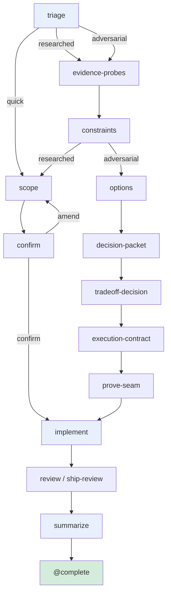
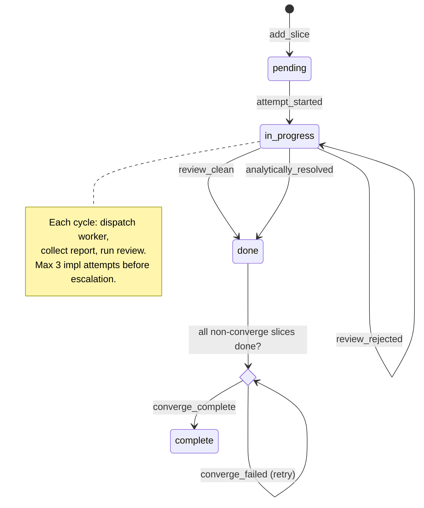
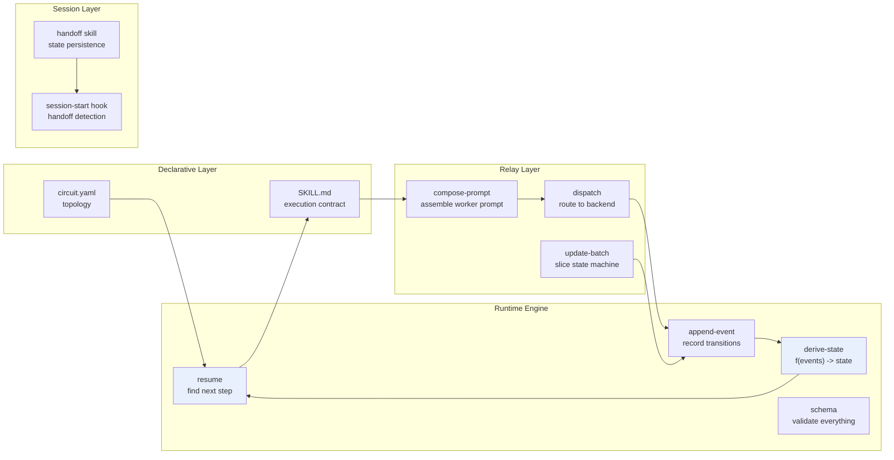

# Circuitry: A Literate Guide

*How a Claude Code plugin turns fragile AI sessions into crash-safe, multi-phase workflows*

---

## Table of Contents

- [S1. The Problem](#s1-the-problem)
- [S2. The Core Insight: Artifacts Over Chat](#s2-the-core-insight-artifacts-over-chat)
- [S3. What a Circuit Is](#s3-what-a-circuit-is)
- [S4. The Supergraph](#s4-the-supergraph)
- [S5. Triage: One Command, Seven Paths](#s5-triage-one-command-seven-paths)
- [S6. The Three Executor Types](#s6-the-three-executor-types)
- [S7. Gates: How Steps Prove They Are Done](#s7-gates-how-steps-prove-they-are-done)
- [S8. Event Sourcing: The Append-Only Truth](#s8-event-sourcing-the-append-only-truth)
- [S9. Deriving State: f(events) -> state](#s9-deriving-state-fevents---state)
- [S10. Resume: Finding Where We Left Off](#s10-resume-finding-where-we-left-off)
- [S11. The Relay Layer: Talking to Workers](#s11-the-relay-layer-talking-to-workers)
- [S12. The Batch State Machine](#s12-the-batch-state-machine)
- [S13. Session Handoff](#s13-session-handoff)
- [S14. The Shape of the Whole Thing](#s14-the-shape-of-the-whole-thing)

---

## S1. The Problem

AI coding sessions are fragile. You ask Claude to build a feature, it gets halfway through, and the session dies. Context is gone. You start a new session, re-explain everything, and watch it redo work or take a different approach. If the feature needed research before coding, that research happened in-context and vanished with it. If the implementation needed a code review, that review happened in the same session that wrote the code, which is like grading your own homework.

Circuitry exists because these problems compound. A bug fix might be simple enough to survive one session, but an architecture decision that requires evidence gathering, option generation, adversarial evaluation, and then implementation across multiple files -- that will span sessions whether you plan for it or not. The question is whether you lose everything at each boundary or carry it forward.

The plugin installs into Claude Code and provides a single entry point: `/circuit <task>`. From there, Circuitry classifies the task, selects a workflow, walks it step by step, persists everything to disk, and picks up exactly where it stopped if the session crashes. The user steps in at checkpoints. The rest is autonomous.

---

## S2. The Core Insight: Artifacts Over Chat

The foundational design decision in Circuitry is that **artifacts, not the conversation, are the source of truth**. Every step in a circuit reads named input files and writes named output files. Progress is measured by which artifacts exist and whether their quality gates passed. The chat window is an ephemeral scratchpad; the artifact chain is the durable record.

This is what makes crash recovery possible. When a session resumes, it does not try to reconstruct the conversation. It checks which artifacts are present, replays the event log (S8) to rebuild state, and finds the first incomplete step (S10). The new session has never seen the old conversation, but it has every artifact the old session produced. That is enough.

It also solves the bounded-context problem. A step that generates implementation options does not need to see the raw evidence digests -- it reads the constraints artifact, which is a synthesis of those digests. Each step sees only what it declares in its `reads` list, preventing the context window from filling with irrelevant material. The artifact chain acts as a series of compression stages, where each step distills its inputs into a tighter output for downstream consumers.

---

## S3. What a Circuit Is

A circuit is a directed graph of steps, declared in two files that work together:

- **`circuit.yaml`** -- the machine-readable topology (which steps exist, what they read and write, how they connect)
- **`SKILL.md`** -- the execution contract (what the orchestrator should actually *do* at each step)

The YAML defines structure; the Markdown defines behavior. This split is deliberate. The runtime engine (S9, S10) only needs the YAML to determine where a run is and where it should go next. The orchestrating Claude session reads the SKILL.md to know *how* to execute each step.

Here is the opening of the supergraph's circuit.yaml, which declares the circuit's identity and its seven entry modes:

```yaml
# skills/run/circuit.yaml:1-38
schema_version: "2"
circuit:
  id: run
  version: "2026-04-03"
  purpose: >
    Adaptive workflow circuit. Triage classifies any task into one of seven
    workflows and walks the selected path. Steps on inactive paths are
    never visited.

  entry_modes:
    default:
      start_at: triage
      description: Triage classifies to quick, researched, or adversarial.
    quick:
      start_at: triage
      description: Intent hint -- triage pre-classifies as quick.
    researched:
      start_at: triage
      description: Intent hint -- triage pre-classifies as researched.
    adversarial:
      start_at: triage
      description: Intent hint -- triage pre-classifies as adversarial.
    spec-review:
      start_at: spec-intake
      description: Existing RFC/PRD to review before build.
    ratchet:
      start_at: ratchet-survey
      description: Overnight quality improvement pass.
    crucible:
      start_at: crucible-frame
      description: Adversarial tournament for competing approaches.
```

Notice that `entry_modes` is not a routing table -- it is a set of starting positions within the same graph. The `quick` mode and the `default` mode both start at `triage`, but the triage step knows to pre-classify quick-hinted tasks rather than doing full analysis. The `ratchet` and `crucible` modes skip triage entirely, entering the graph at dedicated entry points deeper in the topology. This means there is one circuit definition for all seven workflows, not seven separate circuits stitched together. Steps on inactive paths (S5) are simply never visited.

Each step in the YAML declares its executor type (S6), what it reads, what it writes, its quality gate (S7), and its outbound routes:

```yaml
# skills/run/circuit.yaml:44-62
- id: triage
  title: Triage Classification
  executor: orchestrator
  kind: synthesis
  reads: [user.task, repo.snapshot]
  writes:
    artifact:
      path: artifacts/triage-result.md
      schema: triage-result@v1
  gate:
    kind: schema_sections
    source: artifacts/triage-result.md
    required: [Pattern, Mode, Reasoning, Probe]
  routes:
    quick: scope
    researched: evidence-probes
    adversarial: evidence-probes
    redirect_cleanup: "@stop"
    redirect_migrate: "@stop"
```

The `routes` map is the branching mechanism. After triage writes its artifact and the gate validates it, the triage result determines which route fires. If the task is classified as `quick`, execution continues at `scope`. If `researched` or `adversarial`, it jumps to `evidence-probes`. The `@stop` terminal tells the engine to halt and redirect the user to a companion circuit (S5). Routes are how one supergraph encodes multiple workflow shapes without duplication.

---

## S4. The Supergraph

The `circuit:run` supergraph is the primary circuit. It contains every workflow path as a subgraph within a single YAML file. Here is how the paths relate:



The quick path is the shortest: triage -> scope -> confirm -> implement -> summarize. The adversarial path is the longest in this subgraph: triage -> evidence-probes -> constraints -> options -> decision-packet -> tradeoff-decision -> execution-contract -> prove-seam -> implement -> ship-review -> summarize.

Two additional workflow paths -- ratchet (17 steps) and crucible (7 steps) -- have their own entry points and never pass through triage at all. The ratchet path runs batched improvement passes with verification checkpoints between each batch. The crucible path runs a diverge-explore-stress-test tournament to pressure-test competing approaches.

In addition to the supergraph, Circuitry ships two companion circuits:

- **`circuit:cleanup`** -- systematic dead-code removal (survey -> triage -> prove -> clean -> verify)
- **`circuit:migrate`** -- framework-swap migrations (scope -> inventory -> strategy -> execute -> verify)

Triage can redirect to these if it detects that the task is a better fit. The redirect is a `@stop` route with a message telling the user which companion command to run. This keeps the supergraph from growing unboundedly -- specialized workflows get their own circuit rather than being shoehorned into the main one.

---

## S5. Triage: One Command, Seven Paths

When a user types `/circuit add dark mode support to the settings page`, triage is the first step that runs. Its job is to classify the task into one of the seven entry modes, present the classification to the user with a diagnostic probe question, and then route accordingly.

The SKILL.md defines a signal-matching table that triage uses:

| Signal Pattern | Mode |
|---|---|
| Clear task, known approach, <6 files | quick |
| Multi-domain OR external research needed | researched |
| Named alternatives OR "should we" | adversarial |
| Existing RFC/PRD/spec provided | spec-review |
| "Run overnight" OR "improve quality" | ratchet |
| "Pressure-test" OR "explore N approaches" | crucible |
| Strong cleanup signals | redirect to `circuit:cleanup` |
| Strong migration signals | redirect to `circuit:migrate` |

But triage does not just classify -- it also generates a *probe*. The probe is a single question that tests the assumption most likely to be wrong about the classification. For instance, if triage classifies a task as `quick` but the task description mentions "we need to decide between", the probe might be: "You mentioned choosing between approaches -- should we evaluate these as competing options (adversarial) or do you already have a preference (quick)?" This catches misclassifications before any work is done.

Intent hints bypass full classification. The user can prefix their task to pre-select a mode:

```
/circuit fix: login form rejects valid emails        -> quick + bug augmentation
/circuit decide: REST vs GraphQL for the new API     -> adversarial
/circuit develop: add webhook support                -> researched
```

These still run the triage step (so the event log records it), but triage skips analysis and uses the hint directly. The probe still fires as a sanity check.

---

## S6. The Three Executor Types

Every step in the circuit has an executor and a kind. There are three combinations that matter:

**`executor: orchestrator, kind: synthesis`** -- The orchestrating Claude session does the work directly. It reads the declared input artifacts, synthesizes an output, and writes the output artifact. No worker is dispatched. The triage, constraints, and summarize steps are all synthesis steps. These are fast and cheap but limited by the orchestrator's own context window.

**`executor: orchestrator, kind: checkpoint`** -- The orchestrator pauses and presents a decision to the user. The user selects from allowed options (confirm/amend, choose/defer, continue/adjust). The selection is recorded as a checkpoint response, and the gate (S7) routes based on it. This is how the user stays in the loop without being in every loop. The scope-confirmation and tradeoff-decision steps are checkpoints.

**`executor: worker, kind: dispatch`** -- The orchestrator assembles a prompt (S11) and dispatches it to a separate Claude session. The worker runs in isolation, writes a report, and returns a structured result. The orchestrator then evaluates the result against the gate criteria. Implementation, evidence gathering, option generation, and code review all use dispatch steps. Crucially, **the worker and the orchestrator are separate sessions** -- the worker cannot see the orchestrator's context, and the orchestrator evaluates the worker's output at arm's length. This makes independent review genuinely independent.

The dispatch mechanism is backend-agnostic. By default, Circuitry auto-detects whether the Codex CLI is installed and uses it for workers (fully autonomous, headless). If Codex is unavailable, it falls back to the Claude Code Agent tool (which runs a subagent in a worktree). Users can also configure custom backends in `circuit.config.yaml` -- any shell command that accepts a prompt file will work.

---

## S7. Gates: How Steps Prove They Are Done

A step is not "done" just because it ran. It is done when its gate passes. Every non-trivial step has a gate declaration in the circuit YAML:

```yaml
# skills/run/circuit.yaml (constraints step):139-155
- id: constraints
  title: Constraints Synthesis
  executor: orchestrator
  kind: synthesis
  reads: [artifacts/external-digest.md, artifacts/internal-digest.md, artifacts/triage-result.md]
  writes:
    artifact:
      path: artifacts/constraints.md
      schema: constraints@v1
  gate:
    kind: schema_sections
    source: artifacts/constraints.md
    required: [Hard Invariants, Seams and Integration Points, Open Questions]
  routes:
    researched: scope
    adversarial: options
    fail: "@escalate"
```

There are three gate kinds:

**`schema_sections`** -- Checks that the artifact contains the required Markdown headings. The constraints artifact above must have `## Hard Invariants`, `## Seams and Integration Points`, and `## Open Questions` sections. This is a structural check, not a content quality check -- it ensures the step produced the right *shape* of output without trying to evaluate whether the reasoning is sound.

**`checkpoint_selection`** -- Checks that the user selected one of the allowed options. The scope-confirmation checkpoint allows `[confirm, amend]`. If the user selects `amend`, the route loops back to the scope step for revision.

**`result_verdict`** -- Checks the structured verdict in a worker's `job-result.json`. The implement step requires `[complete_and_hardened]`; the evidence-probes step requires `[outputs_ready]`. The verdict is machine-readable and typed -- the event schema (S8) enumerates every valid verdict string, preventing workers from inventing ad-hoc verdicts.

Some gates have **reroute** rules that send work backward if specific verdicts fire. For example, the prove-seam step:

```yaml
# skills/run/circuit.yaml:280-289
gate:
  kind: result_verdict
  source: jobs/{step_id}-{attempt}/job-result.json
  pass: [design_holds, needs_adjustment]
  reroute:
    design_invalidated: "@escalate"
routes:
  design_holds: implement
  needs_adjustment: implement
  design_invalidated: "@escalate"
```

If the seam proof reveals that the design is fundamentally broken (`design_invalidated`), the reroute sends control to `@escalate` instead of pressing forward into implementation. Gates are the circuit breakers that prevent the system from charging ahead when earlier assumptions collapse.

---

## S8. Event Sourcing: The Append-Only Truth

Every significant action in a circuit run is recorded as an event in `events.ndjson` -- an append-only, newline-delimited JSON log. Events are never mutated or deleted. The full history of a run is encoded in this file.

The event schema (`schemas/event.schema.json`) defines 12 event types:

```
run_started          -- A new run begins
step_started         -- The engine enters a step
dispatch_requested   -- A worker prompt has been assembled and queued
dispatch_received    -- The backend acknowledged the dispatch
job_completed        -- A worker returned a result
artifact_written     -- An artifact file was produced
gate_passed          -- A gate evaluated and the step passed
gate_failed          -- A gate evaluated and the step failed
checkpoint_requested -- A checkpoint is waiting for user input
checkpoint_resolved  -- The user responded to a checkpoint
step_reopened        -- A gate failure or reroute sent control backward
run_completed        -- The run reached a terminal state
```

Each event carries a schema version, a UUID, a timestamp, a run ID, and a typed payload. The append-event module (`scripts/runtime/engine/src/append-event.ts`) constructs these records:

```typescript
// scripts/runtime/engine/src/append-event.ts:52-81
export function buildEvent(
  runRoot: string,
  eventType: string,
  payload: object,
  stepId?: string,
  attempt?: number,
): Record<string, unknown> {
  const { circuitId, runId } = readRunIdentity(runRoot);

  const event: Record<string, unknown> = {
    schema_version: "1",
    event_id: randomUUID(),
    event_type: eventType,
    occurred_at: new Date().toISOString(),
    run_id: runId,
    payload,
  };

  if (circuitId) event.circuit_id = circuitId;
  if (stepId) event.step_id = stepId;
  if (attempt !== undefined) event.attempt = attempt;

  return event;
}
```

Every event is validated against the JSON-Schema before being appended. The schema uses Draft 2020-12 conditional validation (`if/then`) to enforce different payload shapes per event type -- a `dispatch_received` event must have `receipt_path`, `backend`, `job_id`, and `attempt`, while an `artifact_written` event must have `artifact_path`. This strictness is what makes replay (S9) reliable: if an event made it into the log, its shape is guaranteed.

The event log is the single source of truth. `state.json` is a derived artifact -- it can be deleted and rebuilt from events at any time. This is the classic event-sourcing guarantee: the projection is disposable, the events are permanent.

---

## S9. Deriving State: f(events) -> state

The heart of the runtime engine is `deriveState()` -- a pure function that takes a manifest and an event list and produces a state object. This is the deterministic projection function, and its correctness is what makes resumability possible.

```typescript
// scripts/runtime/engine/src/derive-state.ts:61-64
export function deriveState(
  manifest: Record<string, unknown>,
  events: Record<string, unknown>[],
): Record<string, unknown> {
```

The function initializes an empty state and then replays every event in order, applying mutation rules:

```typescript
// scripts/runtime/engine/src/derive-state.ts:70-84
const state: Record<string, unknown> = {
  schema_version: "1",
  run_id: "",
  circuit_id: circuitId,
  manifest_version: manifestVersion,
  status: "initialized",
  current_step: null,
  selected_entry_mode: "default",
  git: { head_at_start: "0000000" },
  artifacts: {},
  jobs: {},
  checkpoints: {},
  routes: {},
};
```

Each event type has a specific mutation rule. `step_started` sets `current_step` and `status`. `artifact_written` upserts the artifacts map. `gate_passed` updates artifact gate status and records the chosen route. `step_reopened` resets a step's completion status and marks its artifacts as stale. The switch over event types is exhaustive and each branch is self-contained:

```typescript
// scripts/runtime/engine/src/derive-state.ts:109-117 (run_started rule)
if (eventType === "run_started") {
  state.run_id = (event.run_id ?? "") as string;
  state.selected_entry_mode = (payload.entry_mode ?? "default") as string;
  state.started_at = occurredAt;
  state.updated_at = occurredAt;
  (state.git as Record<string, unknown>).head_at_start =
    (payload.head_at_start ?? "0000000") as string;
  state.status = "initialized";
}
```

```typescript
// scripts/runtime/engine/src/derive-state.ts:234-250 (gate_passed rule)
else if (eventType === "gate_passed") {
  const gateStepId = (payload.step_id ?? "") as string;
  const route = (payload.route ?? "") as string;
  for (const artInfo of Object.values(artifacts)) {
    if (artInfo.produced_by === gateStepId) {
      artInfo.gate = "pass";
      artInfo.updated_at = occurredAt;
    }
  }
  stepCompletion[gateStepId] = { gate_evaluated: true, route };
  if (route) {
    routes[gateStepId] = route;
  }
  state.updated_at = occurredAt;
}
```

The `routes` map is particularly important. It records which outbound route was taken at each step. When the resume algorithm (S10) walks the step graph, it follows these recorded routes to traverse the same path the original run took. Without the routes map, the engine could not distinguish "this step has not been reached yet" from "this step was on an inactive path."

The state schema (`schemas/state.schema.json`) validates the projection output. The status field is an enum with nine possible values -- `initialized`, `in_progress`, `waiting_checkpoint`, `waiting_worker`, `completed`, `stopped`, `blocked`, `failed`, `handed_off` -- each encoding a specific point in the lifecycle. `waiting_worker` means a dispatch is in flight and the orchestrator should check on it. `waiting_checkpoint` means the user needs to make a decision. `blocked` means an `@escalate` terminal was reached and human intervention is needed.

---

## S10. Resume: Finding Where We Left Off

When a session crashes and a new one begins, the resume module determines where to pick up. The algorithm is:

1. Load `state.json`, or rebuild it from events if it is stale or missing
2. Check if the run is in a terminal state (completed, stopped, blocked, handed_off)
3. Get the entry mode's start step and walk the graph in order
4. Find the first step that is not complete

Step 1 uses filesystem timestamps to detect staleness:

```typescript
// scripts/runtime/engine/src/resume.ts:39-69
export function loadOrRebuildState(runRoot: string): object {
  const statePath = join(runRoot, "state.json");
  const eventsPath = join(runRoot, "events.ndjson");

  let needsRebuild = false;

  if (!existsSync(statePath)) {
    needsRebuild = true;
  } else if (existsSync(eventsPath)) {
    const stateMtime = statSync(statePath).mtimeMs;
    const eventsMtime = statSync(eventsPath).mtimeMs;
    if (eventsMtime > stateMtime) {
      needsRebuild = true;
    }
  }

  if (needsRebuild) {
    const manifest = loadManifest(runRoot);
    const events = loadEvents(runRoot);
    const state = deriveState(manifest, events);
    // ... validate and write ...
    return state;
  }

  return JSON.parse(readFileSync(statePath, "utf-8"));
}
```

If `events.ndjson` has a newer modification time than `state.json`, the state is stale -- events were appended without re-deriving. This happens when a session crashes after appending an event but before writing the updated state. The rebuild is cheap (linear scan of events) and produces a validated state.

Step 4 -- finding the first incomplete step -- uses `walkStepOrder()` to traverse the graph respecting recorded routes:

```typescript
// scripts/runtime/engine/src/resume.ts:113-167
export function walkStepOrder(
  manifest: any,
  startStep: string | null,
  state?: any,
): string[] {
  const steps = buildStepGraph(manifest);
  const stepIds = steps.map((s: any) => s.id as string);
  // ...
  const routeMap = recordedRoutes as Record<string, string>;

  let currentStep = startStep ?? stepIds[0];
  const visited = new Set<string>();
  const traversedSteps: string[] = [];

  while (currentStep && stepIds.includes(currentStep) && !visited.has(currentStep)) {
    traversedSteps.push(currentStep);
    visited.add(currentStep);

    const nextStep = routeMap[currentStep];
    if (!nextStep || nextStep.startsWith("@")) break;
    if (!stepIds.includes(nextStep)) break;

    currentStep = nextStep;
  }

  return traversedSteps;
}
```

This is where the routes map (S9) pays off. The walk follows recorded routes from the state rather than trying all possible branches. If triage routed to `evidence-probes`, the walk follows that edge and never considers the `scope` branch. Steps on inactive paths are never visited, so they are never candidates for resume.

A step is considered complete when its gate has been evaluated and a route recorded. The `isStepComplete()` function checks three signals: (1) the step has a recorded route, (2) all artifacts produced by the step have non-pending gate status, or (3) the step's checkpoint was resolved. The first incomplete step in traversal order is the resume point.

---

## S11. The Relay Layer: Talking to Workers

When a dispatch step fires, the orchestrator needs to assemble a prompt, send it to a worker, and collect the result. This is the relay layer: three shell scripts that handle prompt composition, backend dispatch, and batch state mutation.

**`compose-prompt.sh`** assembles a worker prompt from modular pieces:

```
[prompt-header.md]     -- Task-specific mission, inputs, output path, schema
[domain skill SKILL.md] -- Optional: e.g., tdd, swift-apps, rust (from ~/.claude/skills/)
[template]             -- Optional: implement, review, converge (from workers/references/)
```

The orchestrator writes a prompt header that describes the specific task. Then compose-prompt resolves any domain skills by name (searching a configurable skill directory path), appends a template for the worker role, and writes the assembled prompt to disk. A key detail: the script tracks which source files introduce `{relay_root}` placeholder tokens and reports diagnostics if any remain unresolved after assembly.

**`dispatch.sh`** is backend-agnostic routing. It auto-detects the dispatch engine using a fallback chain:

```
explicit --backend flag
  -> circuit.config.yaml per-circuit setting
    -> circuit.config.yaml global setting
      -> auto-detect (Codex CLI if installed, else Agent tool)
```

For Codex, it runs `codex exec --full-auto` with the assembled prompt. For Agent, it emits a JSON receipt that the orchestrator uses to spawn a Claude Code Agent subagent with worktree isolation. For custom backends, it invokes the backend string as a shell command, passing the prompt file and output path as arguments. This extensibility means Circuitry can dispatch to any AI coding tool -- Gemini, a custom wrapper, a human reviewer who reads the prompt and writes a report.

The dispatch always produces a **receipt** -- a JSON file recording what was dispatched, when, and to which backend. The receipt is written to the jobs directory alongside the dispatch request and (eventually) the job result. This creates an audit trail (S8) that the orchestrator uses to check on in-flight work.

---

## S12. The Batch State Machine

For implementation-heavy steps, a single worker dispatch is often not enough. The `workers` skill orchestrates a plan-implement-review-converge cycle using a dedicated state machine backed by `batch.json`.

The batch state machine (`scripts/runtime/engine/src/update-batch.ts`) manages a collection of **slices** -- discrete work items within a batch. Each slice tracks its own lifecycle:

```typescript
// scripts/runtime/engine/src/update-batch.ts:20-37
export interface Slice {
  id: string;
  type: string;        // "implement" | "review" | "converge"
  task: string;
  status: "pending" | "in_progress" | "done";
  impl_attempts: number;
  review_rejections: number;
  attempt_in_progress?: boolean;
  review?: string;
  resolution?: string;
  // ...
}
```

The batch itself has a phase (`implement`, `converge`, `complete`), a current slice pointer, and a list of slices:

```typescript
// scripts/runtime/engine/src/update-batch.ts:39-46
export interface Batch {
  batch_id?: string;
  phase: string;
  current_slice: string;
  slices: Slice[];
  convergence_attempts?: number;
  last_convergence_note?: string;
}
```

Transitions happen through named events. The `applyRecord()` function is the state machine's core -- a pure function that takes a batch and an event record and produces the next batch state:

```typescript
// scripts/runtime/engine/src/update-batch.ts:399-401
export function applyRecord(batch: Batch, record: EventRecord): void {
  const recordEvent = record.event;
  const mutation = record.mutation || recordEvent;
```

The event types map to specific mutations:

- **`attempt_started`** -- Increments `impl_attempts`, sets `attempt_in_progress`
- **`impl_dispatched`** -- Clears the attempt flag, records verification
- **`review_clean`** -- Sets slice status to `done`, advances to next pending slice
- **`review_rejected`** -- Increments `review_rejections`, keeps slice in progress
- **`converge_complete`** -- Sets all converge slices to `done`, phase to `complete`
- **`converge_failed`** -- Increments `convergence_attempts`

Two safety mechanisms prevent invalid transitions. First, the `DONE_SLICE_EVENTS` set blocks events that would modify a completed slice:

```typescript
// scripts/runtime/engine/src/update-batch.ts:106-112
const DONE_SLICE_EVENTS = new Set([
  "attempt_started",
  "impl_dispatched",
  "review_clean",
  "review_rejected",
]);
```

If any of these events target a slice with `status: "done"`, the state machine rejects the transition with an error. Second, `converge_complete` validates that all non-converge slices are done before allowing the batch to complete -- you cannot declare convergence while implementation slices are still pending.

The batch also has its own event log (`events.ndjson` in the relay root), separate from the circuit-level event log. This dual-layer event sourcing means the batch state can be rebuilt independently of the circuit state, and the `--rebuild` flag does exactly that: replay the batch events over the original plan to reconstruct `batch.json`.

The typical lifecycle of a batch looks like this:



---

## S13. Session Handoff

Circuitry provides two mechanisms for surviving session boundaries: automatic resume (S10) via the artifact chain, and explicit handoff via the `/circuit:handoff` skill.

The automatic path works without user intervention. The event log and artifacts persist on disk; a new session rebuilds state and finds the resume point. But this only captures *what happened*. It does not capture *why* -- the decisions made, the approaches ruled out, the constraints discovered during conversation.

The handoff skill captures this soft context. When invoked, it writes a structured file to `~/.claude/projects/<slug>/handoff.md`:

```
# Handoff
WRITTEN: 2026-04-04T17:35:00Z
DIR: /Users/petepetrash/Code/circuitry

NEXT: DO: <exact next action>
GOAL: <what done looks like> [VERIFY: confirm before acting]
STATE:
- <facts invisible to git>
DEBT:
- DECIDED: <decision> -- <reason>
- RULED OUT: <approach> -- <why>
- CONSTRAINT: <operating rule>
```

The session-start hook (`hooks/session-start.sh`) checks for this file on every new session:

```bash
# hooks/session-start.sh:4-11
if git rev-parse --show-toplevel >/dev/null 2>&1; then
  handoff_dir="$(git rev-parse --show-toplevel)"
else
  handoff_dir="$PWD"
fi
handoff_slug=$(printf '%s' "$handoff_dir" | tr '/' '-')
handoff_file="$HOME/.claude/projects/${handoff_slug}/handoff.md"
```

The slug is derived from the git root, not `$PWD`, so the handoff file can be found from any subdirectory within the repo. If the file exists and starts with `# Handoff`, the hook injects it into the session context with structured resume instructions. If no handoff exists, it shows a brief welcome banner with example commands.

The handoff file is deliberately terse. It uses token targets (80 for simple sessions, 150 for medium, 300 for complex) and a compression order: cut anything git can show, cut history, cut hedging, compress to noun phrases. The DEBT section uses typed prefixes (`DECIDED:`, `RULED OUT:`, `BLOCKED:`, `CONSTRAINT:`) so the consuming session can distinguish between "this was tried and rejected" and "this was tried and accepted."

Together, the artifact chain handles the machine-readable state and the handoff handles the human-readable context. A fresh session that picks up from both sources has everything it needs to continue without asking the user to re-explain.

---

## S14. The Shape of the Whole Thing

Stepping back, Circuitry is four systems that compose:



**The declarative layer** defines what the workflow looks like. Circuit authors write YAML topology and Markdown execution contracts. They never touch the engine.

**The runtime engine** maintains the truth. Events go in, state comes out. The projection is deterministic. Schema validation catches structural errors at write time rather than read time. Resume walks the graph and finds where to continue.

**The relay layer** talks to workers. It assembles prompts from modular pieces, dispatches to whichever backend is available, and manages the batch state machine for multi-slice implementations. The batch state machine is deliberately simpler than the circuit-level event sourcing -- it uses direct mutation with an event ledger rather than full replay-on-read -- because batches are shorter-lived and the state is less complex.

**The session layer** handles the human boundary. The hook detects pending handoffs and injects them. The handoff skill captures the soft context that artifacts do not encode.

The key architectural bet is that **the artifact chain is the execution engine**. Every step is defined by what it reads and writes. Resumability is automatic because the engine can always check which artifacts exist and which gates passed. Quality is enforced because gates are structural checks, not honor-system self-reports. And crash safety is free because events are append-only and state is a derived projection.

This is a system designed for one user doing serious work with AI coding tools. It does not try to be a team workflow platform or a CI/CD pipeline. It is a power tool for an individual developer who wants Claude Code to execute multi-phase work with the same rigor a human team would bring -- research before coding, independent review, crash recovery, and quality gates that cannot be skipped.
